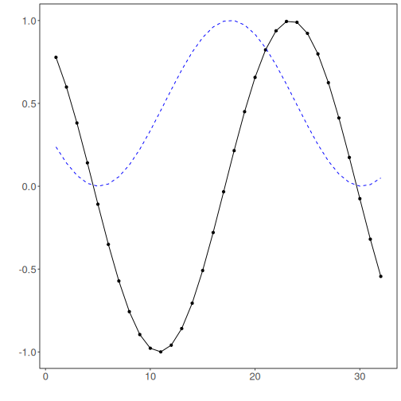

## Differencing Normalization

About the technique

- Differencing replaces each value by its change relative to the previous observation.
- This reduces trend effects and often makes the series easier to scale and model.
- In sliding-window form, the transformation shortens the window by one column because consecutive differences are taken across the full supervised window.

Didactic goal: see how stabilization by differencing changes both the level and the interpretation of the series.


``` r
source(url("https://raw.githubusercontent.com/cefet-rj-dal/tspredit/main/examples/seed.R"))
# Normalization by Differences (Diff)

# Installing the package (if needed)
#install.packages("tspredit")
```

We start by loading the packages used throughout this example.


``` r
library(daltoolbox)
library(tspredit)
library(ggplot2)
```

We load the example series that will be used throughout the demonstration.


``` r
data(tsd)
```

The first plot shows the original series. This is the common visual reference
for all normalization examples in this folder.


``` r
plot_ts(x = tsd$x, y = tsd$y) + theme(text = element_text(size = 16))
```


The next step organizes the series into sliding windows, which is the tabular
representation used by the later transformations and models.


``` r
sw_size <- 10
ts <- ts_data(tsd$y, sw_size)
ts_head(ts, 3)
```

```
##             t9        t8        t7        t6        t5        t4        t3        t2        t1        t0
## [1,] 0.0000000 0.2474040 0.4794255 0.6816388 0.8414710 0.9489846 0.9974950 0.9839859 0.9092974 0.7780732
## [2,] 0.2474040 0.4794255 0.6816388 0.8414710 0.9489846 0.9974950 0.9839859 0.9092974 0.7780732 0.5984721
## [3,] 0.4794255 0.6816388 0.8414710 0.9489846 0.9974950 0.9839859 0.9092974 0.7780732 0.5984721 0.3816610
```

``` r
summary(ts[, 10])
```

```
##        t0          
##  Min.   :-0.99929  
##  1st Qu.:-0.55091  
##  Median : 0.05397  
##  Mean   : 0.02988  
##  3rd Qu.: 0.63279  
##  Max.   : 0.99460
```

We now apply differencing-based normalization and compare the supervised target
column (`t0`) before and after the transformation.


``` r
preproc <- ts_norm_diff()
set_example_seed()
preproc <- fit(preproc, ts)
tst <- transform(preproc, ts)
ts_head(tst, 3)
```

```
##             t8        t7        t6        t5        t4        t3        t2        t1         t0
## [1,] 0.9982009 0.9672887 0.9073861 0.8222178 0.7170790 0.5985067 0.4738732 0.3509276 0.23731412
## [2,] 0.9672887 0.9073861 0.8222178 0.7170790 0.5985067 0.4738732 0.3509276 0.2373141 0.14009662
## [3,] 0.9073861 0.8222178 0.7170790 0.5985067 0.4738732 0.3509276 0.2373141 0.1400966 0.06531964
```

``` r
summary(tst[, 9])
```

```
##        t0         
##  Min.   :0.00000  
##  1st Qu.:0.06333  
##  Median :0.29337  
##  Mean   :0.40975  
##  3rd Qu.:0.75129  
##  Max.   :1.00000
```

``` r
compare_t0 <- rbind(
  data.frame(idx = seq_len(nrow(ts)), value = as.vector(ts[, ncol(ts)]), series = "original t0"),
  data.frame(idx = seq_len(nrow(tst)), value = as.vector(tst[, ncol(tst)]), series = "transformed t0")
)

plot_ts_pred(
  x = compare_t0[compare_t0$series == "original t0", "idx"],
  y = compare_t0[compare_t0$series == "original t0", "value"],
  yadj = compare_t0[compare_t0$series == "transformed t0", "value"]
) + theme(text = element_text(size = 16))
```



What to observe

- The transformed target now represents local variation rather than absolute level.
- This is useful when trend reduction matters more than preserving the original scale.

References

- G. E. P. Box, G. M. Jenkins, G. C. Reinsel, and G. M. Ljung (2015). Time Series Analysis: Forecasting and Control. Wiley.
