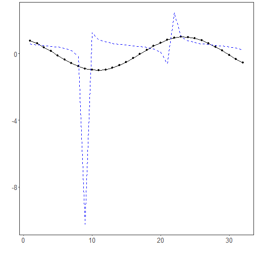

## Adaptive Divisive Normalization

About the technique

- Divisive adaptive normalization rescales each window by its own adaptive reference level.
- It is useful when the same local pattern appears at different amplitudes and should be seen as similar by the predictor.
- Within the adaptive-normalization family implemented by `ts_norm_an()`, this is the default operator: `operation = "divide"`.
- In the current package contract, that adaptive reference is estimated on the full supervised window, so the transformed `t0` follows the same window-wise normalization rule as the lagged values.

Didactic goal: understand adaptive normalization as a relative-scale transformation that tracks level drift over time.


``` r
source(url("https://raw.githubusercontent.com/cefet-rj-dal/tspredit/main/examples/seed.R"))
# Adaptive Divisive Normalization

# Installing the package (if needed)
#install.packages("tspredit")
```

We start by loading the packages used throughout this example.


``` r
library(daltoolbox)
```

```
## 
## Attaching package: 'daltoolbox'
```

```
## The following object is masked from 'package:base':
## 
##     transform
```

``` r
library(tspredit)
library(ggplot2)
```

```
## Warning: package 'ggplot2' was built under R version 4.5.3
```

We load the example series that will be used throughout the demonstration.


``` r
data(tsd)
```

The first plot shows the original series. This is the common visual reference
for all normalization examples in this folder.


``` r
plot_ts(x = tsd$x, y = tsd$y) + theme(text = element_text(size = 16))
```


The next step organizes the series into sliding windows, which is the tabular
representation used by the later transformations and models.


``` r
sw_size <- 10
ts <- ts_data(tsd$y, sw_size)
ts_head(ts, 3)
```

```
##             t9        t8        t7        t6        t5        t4        t3
## [1,] 0.0000000 0.2474040 0.4794255 0.6816388 0.8414710 0.9489846 0.9974950
## [2,] 0.2474040 0.4794255 0.6816388 0.8414710 0.9489846 0.9974950 0.9839859
## [3,] 0.4794255 0.6816388 0.8414710 0.9489846 0.9974950 0.9839859 0.9092974
##             t2        t1        t0
## [1,] 0.9839859 0.9092974 0.7780732
## [2,] 0.9092974 0.7780732 0.5984721
## [3,] 0.7780732 0.5984721 0.3816610
```

``` r
summary(ts[, 10])
```

```
##        t0          
##  Min.   :-0.99929  
##  1st Qu.:-0.55091  
##  Median : 0.05397  
##  Mean   : 0.02988  
##  3rd Qu.: 0.63279  
##  Max.   : 0.99460
```

We now apply the divisive version of adaptive normalization and compare the
supervised target column (`t0`) before and after the transformation.


``` r
preproc <- ts_norm_an()
set_example_seed()
preproc <- fit(preproc, ts)
tst <- transform(preproc, ts)
ts_head(tst, 3)
```

```
##             t9        t8        t7        t6        t5        t4        t3
## [1,] 0.4149898 0.4690512 0.5197513 0.5639379 0.5988636 0.6223569 0.6329571
## [2,] 0.4647178 0.5113539 0.5519987 0.5841248 0.6057350 0.6154855 0.6127702
## [3,] 0.5096517 0.5495785 0.5811372 0.6023656 0.6119439 0.6092766 0.5945294
##             t2        t1        t0
## [1,] 0.6300052 0.6136847 0.5850102
## [2,] 0.5977579 0.5713819 0.5352822
## [3,] 0.5686194 0.5331573 0.4903483
```

``` r
summary(tst[, 10])
```

```
##        t0          
##  Min.   :-10.2200  
##  1st Qu.:  0.3242  
##  Median :  0.4806  
##  Mean   :  0.1852  
##  3rd Qu.:  0.5989  
##  Max.   :  2.4320
```

``` r
compare_t0 <- rbind(
  data.frame(idx = seq_len(nrow(ts)), value = as.vector(ts[, ncol(ts)]), series = "original t0"),
  data.frame(idx = seq_len(nrow(tst)), value = as.vector(tst[, ncol(tst)]), series = "transformed t0")
)

plot_ts_pred(
  x = compare_t0[compare_t0$series == "original t0", "idx"],
  y = compare_t0[compare_t0$series == "original t0", "value"],
  yadj = compare_t0[compare_t0$series == "transformed t0", "value"]
) + theme(text = element_text(size = 16))
```



What to observe

- The transformed target emphasizes relative deviations from the adaptive local level.
- This is the most direct adaptive alternative when scale invariance matters more than additive offsets.

References

- Ogasawara, E., Martinez, L. C., De Oliveira, D., Zimbrão, G., Pappa, G. L., Mattoso, M. (2010).
Adaptive Normalization: A novel data normalization approach for non-stationary time series.
Proceedings of the International Joint Conference on Neural Networks (IJCNN).
doi:10.1109/IJCNN.2010.5596746
