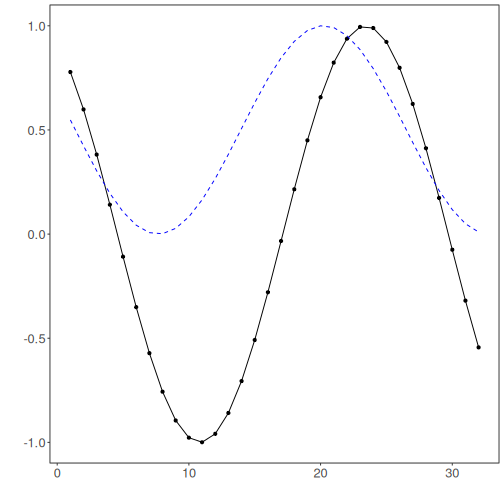

## Adaptive Subtractive Normalization

About the technique

- Subtractive adaptive normalization removes the adaptive local level from each window.
- It is useful when the relevant signal is a deviation around a moving baseline, especially near zero where divisive normalization can become unstable.
- Within the adaptive-normalization family implemented by `ts_norm_an()`, this corresponds to `operation = "subtract"`.
- The adaptive reference is estimated on the full supervised window, so the same complete window geometry is used in both `fit()` and `transform()`.

Didactic goal: see adaptive normalization as a local detrending operator that preserves additive contrasts.


``` r
source(url("https://raw.githubusercontent.com/cefet-rj-dal/tspredit/main/examples/seed.R"))
# Adaptive Subtractive Normalization

# Installing the package (if needed)
#install.packages("tspredit")
```

We start by loading the packages used throughout this example.


``` r
library(daltoolbox)
library(tspredit)
library(ggplot2)
```

We load the example series that will be used throughout the demonstration.


``` r
data(tsd)
```

The first plot shows the original series. This is the common visual reference
for all normalization examples in this folder.


``` r
plot_ts(x = tsd$x, y = tsd$y) + theme(text = element_text(size = 16))
```


The next step organizes the series into sliding windows, which is the tabular
representation used by the later transformations and models.


``` r
sw_size <- 10
ts <- ts_data(tsd$y, sw_size)
ts_head(ts, 3)
```

```
##             t9        t8        t7        t6        t5        t4        t3        t2        t1        t0
## [1,] 0.0000000 0.2474040 0.4794255 0.6816388 0.8414710 0.9489846 0.9974950 0.9839859 0.9092974 0.7780732
## [2,] 0.2474040 0.4794255 0.6816388 0.8414710 0.9489846 0.9974950 0.9839859 0.9092974 0.7780732 0.5984721
## [3,] 0.4794255 0.6816388 0.8414710 0.9489846 0.9974950 0.9839859 0.9092974 0.7780732 0.5984721 0.3816610
```

``` r
summary(ts[, 10])
```

```
##        t0          
##  Min.   :-0.99929  
##  1st Qu.:-0.55091  
##  Median : 0.05397  
##  Mean   : 0.02988  
##  3rd Qu.: 0.63279  
##  Max.   : 0.99460
```

We now apply the subtractive version of adaptive normalization and compare the
supervised target column (`t0`) before and after the transformation.


``` r
preproc <- ts_norm_an(operation = "subtract")
set_example_seed()
preproc <- fit(preproc, ts)
tst <- transform(preproc, ts)
ts_head(tst, 3)
```

```
##             t9        t8        t7        t6        t5        t4        t3        t2        t1        t0
## [1,] 0.1426727 0.2715416 0.3923982 0.4977280 0.5809822 0.6369844 0.6622527 0.6552160 0.6163119 0.5479592
## [2,] 0.2403681 0.3612247 0.4665545 0.5498087 0.6058109 0.6310792 0.6240425 0.5851384 0.5167857 0.4232342
## [3,] 0.3542314 0.4595612 0.5428154 0.5988176 0.6240859 0.6170493 0.5781452 0.5097925 0.4162410 0.3033073
```

``` r
summary(tst[, 10])
```

```
##        t0          
##  Min.   :0.001746  
##  1st Qu.:0.114768  
##  Median :0.403130  
##  Mean   :0.443849  
##  3rd Qu.:0.758225  
##  Max.   :1.000000
```

``` r
compare_t0 <- rbind(
  data.frame(idx = seq_len(nrow(ts)), value = as.vector(ts[, ncol(ts)]), series = "original t0"),
  data.frame(idx = seq_len(nrow(tst)), value = as.vector(tst[, ncol(tst)]), series = "transformed t0")
)

plot_ts_pred(
  x = compare_t0[compare_t0$series == "original t0", "idx"],
  y = compare_t0[compare_t0$series == "original t0", "value"],
  yadj = compare_t0[compare_t0$series == "transformed t0", "value"]
) + theme(text = element_text(size = 16))
```



What to observe

- The transformed target behaves like a moving-baseline deviation.
- This is the safest adaptive choice when the local reference level can be close to zero.

References

- Ogasawara, E., Martinez, L. C., De Oliveira, D., Zimbrão, G., Pappa, G. L., Mattoso, M. (2010).
Adaptive Normalization: A novel data normalization approach for non-stationary time series.
Proceedings of the International Joint Conference on Neural Networks (IJCNN).
doi:10.1109/IJCNN.2010.5596746
