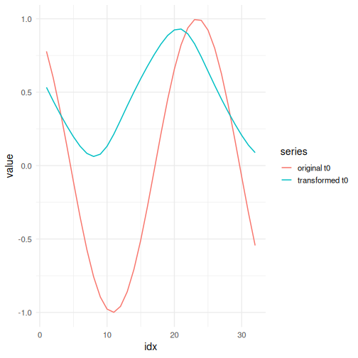

## Adaptive Softdivide Normalization

About the technique

- Softdivide adaptive normalization blends subtractive and divisive behavior through a stabilized denominator.
- It is useful when the series can be close to zero in some windows but still exhibit heteroscedastic scaling in others.
- Within the adaptive-normalization family implemented by `ts_norm_an()`, this corresponds to `operation = "softdivide"`.

Didactic goal: see how a smooth transition between additive and relative normalization regimes can stabilize windows without losing scale comparability.


``` r
source(url("https://raw.githubusercontent.com/cefet-rj-dal/tspredit/main/examples/seed.R"))
# Adaptive Softdivide Normalization

# Installing the package (if needed)
#install.packages("tspredit")
```

We start by loading the packages used throughout this example.


``` r
library(daltoolbox)
library(tspredit)
library(ggplot2)
```

We load the example series that will be used throughout the demonstration.


``` r
data(tsd)
```

The first plot shows the original series. This is the common visual reference
for all normalization examples in this folder.


``` r
plot_ts(x = tsd$x, y = tsd$y) + theme(text = element_text(size = 16))
```


The next step organizes the series into sliding windows, which is the tabular
representation used by the later transformations and models.


``` r
sw_size <- 10
ts <- ts_data(tsd$y, sw_size)
ts_head(ts, 3)
```

```
##             t9        t8        t7        t6        t5        t4        t3        t2        t1        t0
## [1,] 0.0000000 0.2474040 0.4794255 0.6816388 0.8414710 0.9489846 0.9974950 0.9839859 0.9092974 0.7780732
## [2,] 0.2474040 0.4794255 0.6816388 0.8414710 0.9489846 0.9974950 0.9839859 0.9092974 0.7780732 0.5984721
## [3,] 0.4794255 0.6816388 0.8414710 0.9489846 0.9974950 0.9839859 0.9092974 0.7780732 0.5984721 0.3816610
```

``` r
summary(ts[, 10])
```

```
##        t0          
##  Min.   :-0.99929  
##  1st Qu.:-0.55091  
##  Median : 0.05397  
##  Mean   : 0.02988  
##  3rd Qu.: 0.63279  
##  Max.   : 0.99460
```

We now apply the smooth hybrid normalization operator and compare the
supervised target column (`t0`) before and after the transformation.


``` r
preproc <- ts_norm_an(operation = "softdivide", scale = "sd", lambda = 1)
set_example_seed()
preproc <- fit(preproc, ts)
tst <- transform(preproc, ts)
ts_head(tst, 3)
```

```
##             t9        t8        t7        t6        t5        t4        t3        t2        t1        t0
## [1,] 0.2285699 0.3253376 0.4160887 0.4951808 0.5576963 0.5997483 0.6187223 0.6134385 0.5842254 0.5328994
## [2,] 0.3067719 0.3952724 0.4724030 0.5333681 0.5743772 0.5928807 0.5877279 0.5592393 0.5091862 0.4406806
## [3,] 0.3907643 0.4674532 0.5280693 0.5688436 0.5872411 0.5821178 0.5537923 0.5040258 0.4359125 0.3536873
```

``` r
summary(tst[, 10])
```

```
##        t0         
##  Min.   :0.06219  
##  1st Qu.:0.20406  
##  Median :0.42391  
##  Mean   :0.45306  
##  3rd Qu.:0.69267  
##  Max.   :0.93023
```

``` r
compare_t0 <- rbind(
  data.frame(idx = seq_len(nrow(ts)), value = as.vector(ts[, ncol(ts)]), series = "original t0"),
  data.frame(idx = seq_len(nrow(tst)), value = as.vector(tst[, ncol(tst)]), series = "transformed t0")
)

ggplot(compare_t0, aes(x = idx, y = value, color = series)) +
  geom_line(linewidth = 0.7) +
  theme_minimal(base_size = 14)
```



What to observe

- The transformed target behaves more like a difference near zero and more like a ratio at higher levels.
- This is the main compromise operator of the adaptive-normalization family.

References

- Ogasawara, E., Martinez, L. C., De Oliveira, D., Zimbrão, G., Pappa, G. L., Mattoso, M. (2010).
Adaptive Normalization: A novel data normalization approach for non-stationary time series.
Proceedings of the International Joint Conference on Neural Networks (IJCNN).
doi:10.1109/IJCNN.2010.5596746
- Huber, P. J. (1964). Robust Estimation of a Location Parameter.
Annals of Mathematical Statistics, 35(1), 73-101. doi:10.1214/aoms/1177703732
