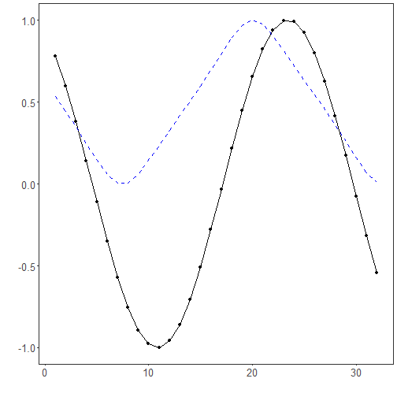

## Adaptive Asinh Normalization

About the technique

- Adaptive asinh normalization applies an inverse-hyperbolic-sine contrast around the adaptive local level.
- It is useful when the analyst wants a transformation that is approximately linear near zero and progressively log-like for larger magnitudes.
- Within the adaptive-normalization family implemented by `ts_norm_an()`, this corresponds to `operation = "asinh"`.
- The adaptive reference is estimated on the full supervised window, so the nonlinear contrast is computed over the same complete window that reaches the downstream model.

Didactic goal: understand a smooth nonlinear alternative that connects additive and multiplicative interpretations without a hard switch.


``` r
source(url("https://raw.githubusercontent.com/cefet-rj-dal/tspredit/main/examples/seed.R"))
# Adaptive Asinh Normalization

# Installing the package (if needed)
#install.packages("tspredit")
```

We start by loading the packages used throughout this example.


``` r
library(daltoolbox)
library(tspredit)
library(ggplot2)
```

We load the example series that will be used throughout the demonstration.


``` r
data(tsd)
```

The first plot shows the original series. This is the common visual reference
for all normalization examples in this folder.


``` r
plot_ts(x = tsd$x, y = tsd$y) + theme(text = element_text(size = 16))
```


The next step organizes the series into sliding windows, which is the tabular
representation used by the later transformations and models.


``` r
sw_size <- 10
ts <- ts_data(tsd$y, sw_size)
ts_head(ts, 3)
```

```
##             t9        t8        t7        t6        t5        t4        t3
## [1,] 0.0000000 0.2474040 0.4794255 0.6816388 0.8414710 0.9489846 0.9974950
## [2,] 0.2474040 0.4794255 0.6816388 0.8414710 0.9489846 0.9974950 0.9839859
## [3,] 0.4794255 0.6816388 0.8414710 0.9489846 0.9974950 0.9839859 0.9092974
##             t2        t1        t0
## [1,] 0.9839859 0.9092974 0.7780732
## [2,] 0.9092974 0.7780732 0.5984721
## [3,] 0.7780732 0.5984721 0.3816610
```

``` r
summary(ts[, 10])
```

```
##        t0          
##  Min.   :-0.99929  
##  1st Qu.:-0.55091  
##  Median : 0.05397  
##  Mean   : 0.02988  
##  3rd Qu.: 0.63279  
##  Max.   : 0.99460
```

We now apply the adaptive asinh operator and compare the supervised target
column (`t0`) before and after the transformation.


``` r
preproc <- ts_norm_an(operation = "asinh", scale = "sd", lambda = 1)
set_example_seed()
preproc <- fit(preproc, ts)
tst <- transform(preproc, ts)
ts_head(tst, 3)
```

```
##             t9        t8        t7        t6        t5        t4        t3
## [1,] 0.1889821 0.3112798 0.4165162 0.4975591 0.5545796 0.5897382 0.6048267
## [2,] 0.2930737 0.3961639 0.4759068 0.5321998 0.5669808 0.5819227 0.5778068
## [3,] 0.3917985 0.4712439 0.5273694 0.5620632 0.5769710 0.5728644 0.5495279
##             t2        t1        t0
## [1,] 0.6006714 0.5770424 0.5326703
## [2,] 0.5544154 0.5105525 0.4442920
## [3,] 0.5057825 0.4397384 0.3499586
```

``` r
summary(tst[, 10])
```

```
##        t0         
##  Min.   :0.00567  
##  1st Qu.:0.15484  
##  Median :0.43082  
##  Mean   :0.44802  
##  3rd Qu.:0.69932  
##  Max.   :1.00000
```

``` r
compare_t0 <- rbind(
  data.frame(idx = seq_len(nrow(ts)), value = as.vector(ts[, ncol(ts)]), series = "original t0"),
  data.frame(idx = seq_len(nrow(tst)), value = as.vector(tst[, ncol(tst)]), series = "transformed t0")
)

plot_ts_pred(
  x = compare_t0[compare_t0$series == "original t0", "idx"],
  y = compare_t0[compare_t0$series == "original t0", "value"],
  yadj = compare_t0[compare_t0$series == "transformed t0", "value"]
) + theme(text = element_text(size = 16))
```



What to observe

- Near zero, the transformed target stays close to an additive contrast.
- For larger deviations, the transformation becomes progressively more log-like without switching abruptly.

References

- Burbidge, J. B., Magee, L., Robb, A. L. (1988). Alternative Transformations to Handle Extreme Values of the Dependent Variable.
Journal of the American Statistical Association, 83(401), 123-127.
- Bellemare, M. F., Wichman, C. J. (2020). Elasticities and the Inverse Hyperbolic Sine Transformation.
Oxford Bulletin of Economics and Statistics, 82(1), 50-61. doi:10.1111/obes.12325
