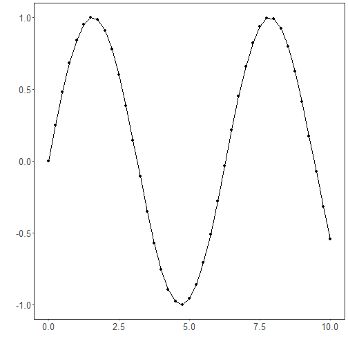
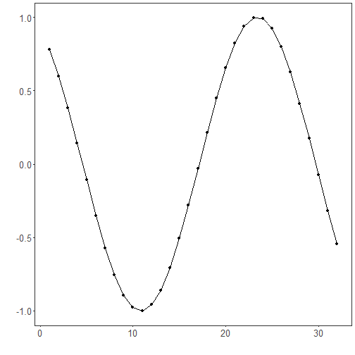

Objective: Difference the series (first differences) and apply min-max normalization, observing level reduction and the effect on scale.

Method
First differencing transforms y_t to y_t − y_{t−1}, removing a unit‑root trend to stabilize the mean. After differencing, optional scaling (e.g., min‑max) standardizes the range for learning algorithms. Always compute scaling parameters on the training segment only.


``` r
# Normalization by Differences (Diff)

# Installing the package (if needed)
#install.packages("tspredit")
```


``` r
# Loading the packages
library(daltoolbox)
library(tspredit) 
```


``` r
# Series for study

data(tsd)
```


``` r
# Series visualization
library(ggplot2)
plot_ts(x=tsd$x, y=tsd$y) + theme(text = element_text(size=16))
```




``` r
# Sliding windows

sw_size <- 10
ts <- ts_data(tsd$y, sw_size)
ts_head(ts, 3)
```

```
##             t9        t8        t7        t6        t5        t4        t3        t2        t1
## [1,] 0.0000000 0.2474040 0.4794255 0.6816388 0.8414710 0.9489846 0.9974950 0.9839859 0.9092974
## [2,] 0.2474040 0.4794255 0.6816388 0.8414710 0.9489846 0.9974950 0.9839859 0.9092974 0.7780732
## [3,] 0.4794255 0.6816388 0.8414710 0.9489846 0.9974950 0.9839859 0.9092974 0.7780732 0.5984721
##             t0
## [1,] 0.7780732
## [2,] 0.5984721
## [3,] 0.3816610
```

``` r
summary(ts[,10])
```

```
##        t0          
##  Min.   :-0.99929  
##  1st Qu.:-0.55091  
##  Median : 0.05397  
##  Mean   : 0.02988  
##  3rd Qu.: 0.63279  
##  Max.   : 0.99460
```


``` r
# Target (t0) visualization after windowing
library(ggplot2)
plot_ts(y=ts[,10]) + theme(text = element_text(size=16))
```




``` r
# Normalization (fit and transform)

preproc <- ts_norm_diff()
preproc <- fit(preproc, ts)
tst <- transform(preproc, ts)
ts_head(tst, 3)
```

```
##             t8        t7        t6        t5        t4        t3        t2        t1         t0
## [1,] 0.9982009 0.9672887 0.9073861 0.8222178 0.7170790 0.5985067 0.4738732 0.3509276 0.23731412
## [2,] 0.9672887 0.9073861 0.8222178 0.7170790 0.5985067 0.4738732 0.3509276 0.2373141 0.14009662
## [3,] 0.9073861 0.8222178 0.7170790 0.5985067 0.4738732 0.3509276 0.2373141 0.1400966 0.06531964
```

``` r
summary(tst[,9])
```

```
##        t0         
##  Min.   :0.00000  
##  1st Qu.:0.06333  
##  Median :0.29337  
##  Mean   :0.40975  
##  3rd Qu.:0.75129  
##  Max.   :1.00000
```

``` r
plot_ts(y=ts[,9]) + theme(text = element_text(size=16))
```


References
- G. E. P. Box, G. M. Jenkins, G. C. Reinsel, and G. M. Ljung (2015). Time Series Analysis: Forecasting and Control. Wiley.
