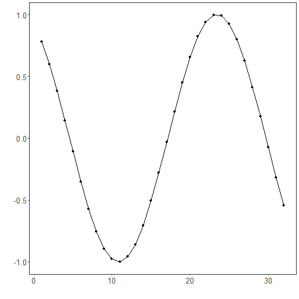

No normalization: No transformation is applied; the data flows unchanged. Use to isolate the effect of normalization by comparison with scaled alternatives.

Objective: Show the pipeline with no normalization (without changing the data), useful as a baseline and to demonstrate the preprocessing interface.


``` r
# No normalization

# Installing the package (if needed)
#install.packages("tspredit")
```


``` r
# Loading the packages
library(daltoolbox)
library(tspredit) 
```


``` r
# Series for study

data(tsd)
```


``` r
library(ggplot2)
plot_ts(x=tsd$x, y=tsd$y) + theme(text = element_text(size=16))
```


``` r
# Sliding windows

sw_size <- 10
ts <- ts_data(tsd$y, sw_size)
ts_head(ts, 3)
```

```
##             t9        t8        t7        t6        t5        t4        t3        t2        t1
## [1,] 0.0000000 0.2474040 0.4794255 0.6816388 0.8414710 0.9489846 0.9974950 0.9839859 0.9092974
## [2,] 0.2474040 0.4794255 0.6816388 0.8414710 0.9489846 0.9974950 0.9839859 0.9092974 0.7780732
## [3,] 0.4794255 0.6816388 0.8414710 0.9489846 0.9974950 0.9839859 0.9092974 0.7780732 0.5984721
##             t0
## [1,] 0.7780732
## [2,] 0.5984721
## [3,] 0.3816610
```

``` r
summary(ts[,10])
```

```
##        t0          
##  Min.   :-0.99929  
##  1st Qu.:-0.55091  
##  Median : 0.05397  
##  Mean   : 0.02988  
##  3rd Qu.: 0.63279  
##  Max.   : 0.99460
```


``` r
library(ggplot2)
plot_ts(y=ts[,10]) + theme(text = element_text(size=16))
```


``` r
# Normalization

preproc <- ts_norm_none()
preproc <- fit(preproc, ts)
tst <- transform(preproc, ts)
ts_head(tst, 3)
```

```
##             t9        t8        t7        t6        t5        t4        t3        t2        t1
## [1,] 0.0000000 0.2474040 0.4794255 0.6816388 0.8414710 0.9489846 0.9974950 0.9839859 0.9092974
## [2,] 0.2474040 0.4794255 0.6816388 0.8414710 0.9489846 0.9974950 0.9839859 0.9092974 0.7780732
## [3,] 0.4794255 0.6816388 0.8414710 0.9489846 0.9974950 0.9839859 0.9092974 0.7780732 0.5984721
##             t0
## [1,] 0.7780732
## [2,] 0.5984721
## [3,] 0.3816610
```

``` r
summary(tst[,10])
```

```
##        t0          
##  Min.   :-0.99929  
##  1st Qu.:-0.55091  
##  Median : 0.05397  
##  Mean   : 0.02988  
##  3rd Qu.: 0.63279  
##  Max.   : 0.99460
```

``` r
plot_ts(y=ts[,10]) + theme(text = element_text(size=16))
```



References
- C. M. Bishop (2006). Pattern Recognition and Machine Learning. Springer.
