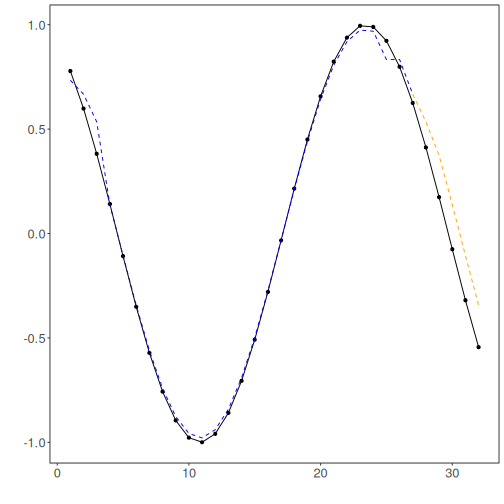

## KNN Regression

About the method
- KNN forecasting searches for past windows that look similar to the current one and predicts from their targets.
- It is a local, nonparametric baseline that is easy to interpret and useful for comparing distance-based behavior.

Didactic goal: understand how sliding-window similarity alone can support forecasting.


``` r
source(url("https://raw.githubusercontent.com/cefet-rj-dal/tspredit/main/examples/seed.R"))
# Time Series Regression - KNN

# Installing the package (if needed)
#install.packages("tspredit")
```

We start by loading the packages used throughout this example.


``` r
# Loading the packages
library(daltoolbox)
library(tspredit) 
```


We load the example series that will be used throughout the demonstration.


``` r
# Series for study and sliding windows

data(tsd)
ts <- ts_data(tsd$y, 10)
ts_head(ts, 3)
```

```
##             t9        t8        t7        t6        t5        t4        t3        t2        t1        t0
## [1,] 0.0000000 0.2474040 0.4794255 0.6816388 0.8414710 0.9489846 0.9974950 0.9839859 0.9092974 0.7780732
## [2,] 0.2474040 0.4794255 0.6816388 0.8414710 0.9489846 0.9974950 0.9839859 0.9092974 0.7780732 0.5984721
## [3,] 0.4794255 0.6816388 0.8414710 0.9489846 0.9974950 0.9839859 0.9092974 0.7780732 0.5984721 0.3816610
```

Before moving on, we visualize the series so the effect of the next transformation can be compared against the original signal.


``` r
# Series visualization
library(ggplot2)
plot_ts(x=tsd$x, y=tsd$y) + theme(text = element_text(size=16))
```


We now preserve the time order, split the data into train and test partitions, and project the windows into inputs and targets.


``` r
# Train-test split and projection (X, y)

samp <- ts_sample(ts, test_size = 5)
io_train <- ts_projection(samp$train)
io_test <- ts_projection(samp$test)
```

We now prepare the preprocessing object that will normalize the inputs before the model is trained.


``` r
# Preprocessing (global min-max normalization)

preproc <- ts_norm_gminmax()
```

We now train the knn model on the prepared training data.


``` r
# Training the KNN model

model <- ts_knn(ts_norm_gminmax(), input_size=4, k=3)
set_example_seed()
model <- fit(model, x=io_train$input, y=io_train$output)
```

We first evaluate the in-sample fit so the model adjustment can be compared with the later forecast.


``` r
# Fit evaluation (train)

adjust <- predict(model, io_train$input)
adjust <- as.vector(adjust)
output <- as.vector(io_train$output)
ev_adjust <- evaluate(model, output, adjust)
ev_adjust$mse
```

```
## [1] 0.00169231
```

We now generate a five-step forecast on the test segment and compare it with the observed values.


``` r
# Forecast on test set (5 steps ahead)

prediction <- predict(model, x=io_test$input[1,], steps_ahead=5)
prediction <- as.vector(prediction)
output <- as.vector(io_test$output)
ev_test <- evaluate(model, output, prediction)
ev_test
```

```
## $values
## [1]  0.41211849  0.17388949 -0.07515112 -0.31951919 -0.54402111
## 
## $prediction
## [1]  0.5349524  0.3737510  0.1381953 -0.1059528 -0.3435132
## 
## $smape
## [1] 0.8890066
## 
## $mse
## [1] 0.0372727
## 
## $R2
## [1] 0.6780737
## 
## $metrics
##         mse     smape        R2
## 1 0.0372727 0.8890066 0.6780737
```

The final plot compares the observed series, the training adjustment, and the forecasted test horizon.


``` r
# Plot comparing actual vs fit (train) and forecast (test)

yvalues <- c(io_train$output, io_test$output)
plot_ts_pred(y=yvalues, yadj=adjust, ypre=prediction, color_prediction="orange") + theme(text = element_text(size=16))
```



References
- T. Cover and P. Hart (1967). Nearest neighbor pattern classification. IEEE Transactions on Information Theory, 13(1), 21–27.

