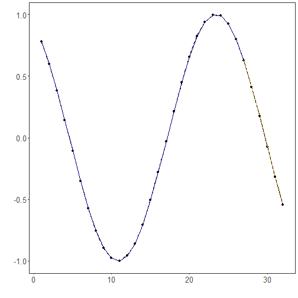

## PyTorch MLP Regression

About the method
- `torch_ts_mlp()` is a feedforward neural forecaster implemented through the `daltoolboxdp` PyTorch backend.
- It keeps the same sliding-window protocol used by the other regressors, while replacing the classical `nnet` learner with a deeper configurable MLP.

Didactic goal: compare the standard `ts_mlp()` baseline with a PyTorch-based feedforward alternative before moving to convolutional and recurrent sequence models.


``` r
source(url("https://raw.githubusercontent.com/cefet-rj-dal/tspredit/main/examples/seed.R"))
# Time Series Regression - PyTorch MLP

# Installing packages (if needed)
# install.packages("tspredit")
```

We start by loading the packages used throughout this example.


``` r
# Loading the packages
library(daltoolbox)
library(daltoolboxdp)
library(tspredit)
```

We load the example series that will be used throughout the demonstration.


``` r
# Series for study and sliding windows

data(tsd)
ts <- ts_data(tsd$y, 10)
ts_head(ts, 3)
```

```
##             t9        t8        t7        t6        t5        t4        t3
## [1,] 0.0000000 0.2474040 0.4794255 0.6816388 0.8414710 0.9489846 0.9974950
## [2,] 0.2474040 0.4794255 0.6816388 0.8414710 0.9489846 0.9974950 0.9839859
## [3,] 0.4794255 0.6816388 0.8414710 0.9489846 0.9974950 0.9839859 0.9092974
##             t2        t1        t0
## [1,] 0.9839859 0.9092974 0.7780732
## [2,] 0.9092974 0.7780732 0.5984721
## [3,] 0.7780732 0.5984721 0.3816610
```

Before moving on, we visualize the series so the effect of the next transformation can be compared against the original signal.


``` r
# Series visualization
library(ggplot2)
plot_ts(x = tsd$x, y = tsd$y) + theme(text = element_text(size = 16))
```


We now preserve the time order, split the data into train and test partitions, and project the windows into inputs and targets.


``` r
# Train-test split and projection (X, y)

samp <- ts_sample(ts, test_size = 5)
io_train <- ts_projection(samp$train)
io_test <- ts_projection(samp$test)
```

We now train the PyTorch MLP model on the prepared training data.


``` r
# Training the PyTorch MLP model

model <- torch_ts_mlp(
  ts_norm_gminmax(),
  input_size = 4,
  hidden_sizes = c(32L, 16L),
  epochs = 200L,
  batch_size = 8L
)
set_example_seed()
model <- fit(model, x = io_train$input, y = io_train$output)
```

We first evaluate the in-sample fit so the model adjustment can be compared with the later forecast.


``` r
# Fit evaluation (train)

adjust <- predict(model, io_train$input)
adjust <- as.vector(adjust)
output <- as.vector(io_train$output)
ev_adjust <- evaluate(model, output, adjust)
ev_adjust$mse
```

```
## [1] 1.727474e-05
```

We now forecast the test set and compare the predicted values with the observed ones.


``` r
# Forecast on test set

prediction <- predict(model, x = io_test$input[1,], steps_ahead = 5)
prediction <- as.vector(prediction)
output <- as.vector(io_test$output)
ev_test <- evaluate(model, output, prediction)
ev_test
```

```
## $values
## [1]  0.41211849  0.17388949 -0.07515112 -0.31951919 -0.54402111
## 
## $prediction
## [1]  0.41312615  0.17741968 -0.06702235 -0.30823471 -0.53065394
## 
## $smape
## [1] 0.03954362
## 
## $mse
## [1] 7.71151e-05
## 
## $R2
## [1] 0.999334
## 
## $metrics
##           mse      smape       R2
## 1 7.71151e-05 0.03954362 0.999334
```

This final plot summarizes the result of the transformation so the effect can be interpreted visually.


``` r
# Plot results

yvalues <- c(io_train$output, io_test$output)
plot_ts_pred(y = yvalues, yadj = adjust, ypre = prediction, color_prediction = "orange") + theme(text = element_text(size = 16))
```



References
- C. M. Bishop (1995). Neural Networks for Pattern Recognition.
- A. Paszke et al. (2019). PyTorch: An Imperative Style, High-Performance Deep Learning Library.
