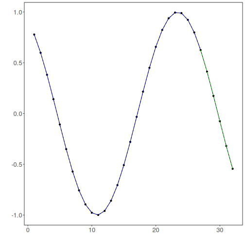

## LSTM Regression

About the method
- LSTM networks are recurrent models designed to retain and update information across ordered inputs.
- They are useful when forecasting depends on sequential dependencies that may span more than a few immediate lags.

Didactic goal: compare a recurrent sequence model with the feedforward and convolutional alternatives.


``` r
source(url("https://raw.githubusercontent.com/cefet-rj-dal/tspredit/main/examples/seed.R"))
# Time Series Regression - LSTM

# Installing packages (if needed)

#install.packages("tspredit")
```

We start by loading the packages used throughout this example.


``` r
# Loading the packages
library(daltoolbox)
library(daltoolboxdp)
library(tspredit)
```


We load the example series that will be used throughout the demonstration.


``` r
# Series for study and sliding windows

data(tsd)
ts <- ts_data(tsd$y, 10)
ts_head(ts, 3)
```

```
##             t9        t8        t7        t6        t5        t4        t3        t2        t1        t0
## [1,] 0.0000000 0.2474040 0.4794255 0.6816388 0.8414710 0.9489846 0.9974950 0.9839859 0.9092974 0.7780732
## [2,] 0.2474040 0.4794255 0.6816388 0.8414710 0.9489846 0.9974950 0.9839859 0.9092974 0.7780732 0.5984721
## [3,] 0.4794255 0.6816388 0.8414710 0.9489846 0.9974950 0.9839859 0.9092974 0.7780732 0.5984721 0.3816610
```

Before moving on, we visualize the series so the effect of the next transformation can be compared against the original signal.


``` r
# Series visualization
library(ggplot2)
plot_ts(x=tsd$x, y=tsd$y) + theme(text = element_text(size=16))
```


We now preserve the time order, split the data into train and test partitions, and project the windows into inputs and targets.


``` r
# Train-test split and projection (X, y)

samp <- ts_sample(ts, test_size = 5)
io_train <- ts_projection(samp$train)
io_test <- ts_projection(samp$test)
```

We now train the lstm model on the prepared training data.


``` r
# Training the LSTM model

model <- ts_lstm(ts_norm_gminmax(), input_size=4, epochs=10000)
set_example_seed()
model <- fit(model, x=io_train$input, y=io_train$output)
```

We first evaluate the in-sample fit so the model adjustment can be compared with the later forecast.


``` r
# Fit evaluation (train)

adjust <- predict(model, io_train$input)
adjust <- as.vector(adjust)
output <- as.vector(io_train$output)
ev_adjust <- evaluate(model, output, adjust)
ev_adjust$mse
```

```
## [1] 2.848104e-07
```

We now forecast the test set and compare the predicted values with the observed ones.


``` r
# Forecast on test set

steps_ahead <- 1
io_test <- ts_projection(samp$test)
prediction <- predict(model, x=io_test$input, steps_ahead=steps_ahead)
prediction <- as.vector(prediction)

output <- as.vector(io_test$output)
if (steps_ahead > 1)
    output <- output[1:steps_ahead]

print(sprintf("%.2f, %.2f", output, prediction))
```

```
## [1] "0.41, 0.41"   "0.17, 0.17"   "-0.08, -0.07" "-0.32, -0.32" "-0.54, -0.54"
```

This chunk evaluates the custom component on the held-out test segment.


``` r
# Test evaluation

ev_test <- evaluate(model, output, prediction)
print(head(ev_test$metrics))
```

```
##          mse       smape        R2
## 1 3.1148e-07 0.001647136 0.9999973
```

``` r
print(sprintf("smape: %.2f", 100*ev_test$metrics$smape))
```

```
## [1] "smape: 0.16"
```

This final plot summarizes the result of the transformation so the effect can be interpreted visually.


``` r
# Plot results

yvalues <- c(io_train$output, io_test$output)
plot_ts_pred(y=yvalues, yadj=adjust, ypre=prediction, color_prediction=if (steps_ahead == 1) "green" else "orange") + theme(text = element_text(size=16))
```



References
- S. Hochreiter and J. Schmidhuber (1997). Long short-term memory. Neural Computation, 9(8), 1735–1780.

