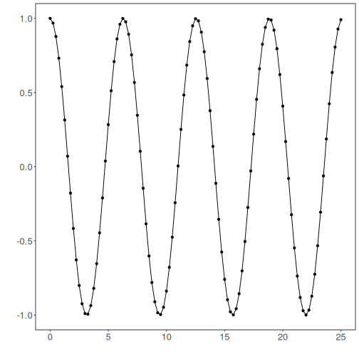
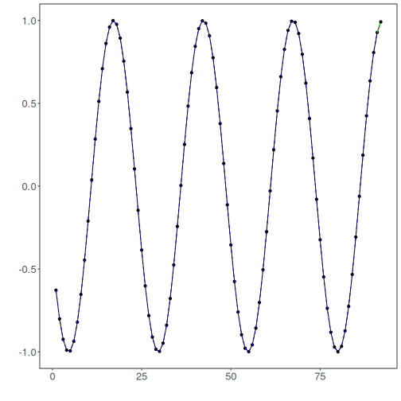

Integrated time series tuning: The integrated tuner composes preprocessing, windowing, and a base learner, then searches over their hyperparameters jointly. Evaluation uses time-aware resampling to avoid look-ahead bias. This unified approach simplifies model selection by returning a fitted pipeline configured with the best-scoring setting on the training data.

What you will learn
- Create sliding windows suitable for supervised learning
- Split the data into train/test respecting time order
- Define a search space and run integrated tuning
- Inspect evaluation metrics and visualize predictions


Objectives: Integrated tuning automates hyperparameter search for time-series learners in a single pipeline. It handles preprocessing, window size, and model hyperparameters, then evaluates and returns the best configuration for your training data.


``` r
source(url("https://raw.githubusercontent.com/cefet-rj-dal/tspredit/main/examples/seed.R"))
# Install tspredit if needed
#install.packages("tspredit")
```

We load the packages required by this example.


``` r
# Load packages
library(daltoolbox)
library(tspredit) 
```


This chunk create a simple cosine series for demonstration.


``` r
# Create a simple cosine series for demonstration

i <- seq(0, 25, 0.25)
x <- cos(i)
```

Before moving on, we visualize the series so the effect of the next transformation can be compared against the original signal.


``` r
# Visualize the time series
plot_ts(x=i, y=x) + theme(text = element_text(size=16))
```




The next step organizes the series into sliding windows, which is the tabular representation used by the later transformations and models.


``` r
# Sliding windows

# Create a sliding-window matrix for supervised learning.
# Each row contains 10 attributes (t9..t0) representing the last 10 observations.
sw_size <- 10
ts <- ts_data(x, sw_size)
ts_head(ts, 3)
```

```
##             t9        t8        t7        t6        t5         t4         t3         t2         t1         t0
## [1,] 1.0000000 0.9689124 0.8775826 0.7316889 0.5403023  0.3153224  0.0707372 -0.1782461 -0.4161468 -0.6281736
## [2,] 0.9689124 0.8775826 0.7316889 0.5403023 0.3153224  0.0707372 -0.1782461 -0.4161468 -0.6281736 -0.8011436
## [3,] 0.8775826 0.7316889 0.5403023 0.3153224 0.0707372 -0.1782461 -0.4161468 -0.6281736 -0.8011436 -0.9243024
```

This chunk data sampling (train/test split).


``` r
# Data sampling (train/test split)

test_size <- 1                  # keep last step for testing
samp <- ts_sample(ts, test_size)
ts_head(samp$train, 3)
```

```
##             t9        t8        t7        t6        t5         t4         t3         t2         t1         t0
## [1,] 1.0000000 0.9689124 0.8775826 0.7316889 0.5403023  0.3153224  0.0707372 -0.1782461 -0.4161468 -0.6281736
## [2,] 0.9689124 0.8775826 0.7316889 0.5403023 0.3153224  0.0707372 -0.1782461 -0.4161468 -0.6281736 -0.8011436
## [3,] 0.8775826 0.7316889 0.5403023 0.3153224 0.0707372 -0.1782461 -0.4161468 -0.6281736 -0.8011436 -0.9243024
```

``` r
ts_head(samp$test)
```

```
##              t9        t8         t7          t6        t5       t4       t3        t2        t1        t0
## [1,] -0.7256268 -0.532833 -0.3069103 -0.06190529 0.1869486 0.424179 0.635036 0.8064095 0.9276444 0.9912028
```

This chunk define integrated tuning we will: - search over input window sizes (3..5) - use elm as the base model - apply global min-max normalization as preprocessing - explore ranges for hidden units and activation function.


``` r
# Define integrated tuning

# We will:
# - search over input window sizes (3..5)
# - use ELM as the base model
# - apply global min-max normalization as preprocessing
# - explore ranges for hidden units and activation function

tune <- ts_integtune(
  input_size = c(3:5),
  base_model = ts_elm(),
  preprocess = list(ts_norm_gminmax()),
  ranges = list(
    nhid = 1:10,
    actfun = c("sig", "radbas", "relu", "purelin")
  )
)
```

This chunk fit the tuned pipeline on training data.


``` r
# Fit the tuned pipeline on training data

io_train <- ts_projection(samp$train)
set_example_seed()
model <- fit(tune, x=io_train$input, y=io_train$output)
```

Before forecasting, we inspect the in-sample adjustment to understand how the fitted model behaves on the training data.


``` r
# Evaluate training adjustment (in-sample)

adjust <- predict(model, io_train$input)
ev_adjust <- evaluate(model, io_train$output, adjust)
print(head(ev_adjust$metrics))
```

```
##            mse       smape R2
## 1 4.686814e-30 5.77268e-15  1
```

This chunk forecast on the test segment.


``` r
# Forecast on the test segment

steps_ahead <- 1
io_test <- ts_projection(samp$test)
prediction <- predict(model, x=io_test$input, steps_ahead=steps_ahead)
prediction <- as.vector(prediction)

output <- as.vector(io_test$output)
if (steps_ahead > 1)
    output <- output[1:steps_ahead]

print(sprintf("%.2f, %.2f", output, prediction))
```

```
## [1] "0.99, 0.99"
```

We evaluate the predictions on the test segment to quantify out-of-sample performance.


``` r
# Evaluate test performance

ev_test <- evaluate(model, output, prediction)
print(head(ev_test$metrics))
```

```
##            mse        smape R2
## 1 8.985619e-30 3.024207e-15 NA
```

``` r
print(sprintf("smape: %.2f", 100*ev_test$metrics$smape))
```

```
## [1] "smape: 0.00"
```

This final plot summarizes the result of the transformation so the effect can be interpreted visually.


``` r
# Plot results

yvalues <- c(io_train$output, io_test$output)
plot_ts_pred(y=yvalues, yadj=adjust, ypre=prediction, color_prediction=if (steps_ahead == 1) "green" else "orange") + theme(text = element_text(size=16))
```



This chunk example hyperparameter ranges by model elm.


``` r
# Example hyperparameter ranges by model

# ELM
ranges_elm <- list(
  nhid = 1:10,
  actfun = c("sig", "radbas", "relu", "purelin")
)

# MLP
ranges_mlp <- list(
  size = 1:8,
  decay = c(0, 1e-4, 1e-3, 1e-2, 1e-1),
  maxit = c(500, 1000, 2000)
)

# RF
ranges_rf <- list(
  nodesize = c(1, 3, 5),
  ntree = c(50, 100, 200),
  mtry = 1:3
)

# SVM
ranges_svm <- list(
  kernel = c("radial", "linear", "polynomial", "sigmoid"),
  epsilon = c(0, 0.01, 0.05, 0.1, 0.2),
  cost = c(1, 5, 10, 20, 50)
)

# LSTM
ranges_lstm <- list(hidden_size = c(4L, 8L, 16L), epochs = c(50L, 100L, 200L))

# CNN
ranges_cnn <- list(conv_channels = c(16L, 32L, 64L), epochs = c(50L, 100L, 200L))
```

These grids are intended for tutorial-scale integrated searches:

- `ELM` explores a compact hidden-size range that is already informative on small sliding-window examples;
- `MLP` uses a short architecture grid plus a coarse regularization grid that is cheaper and usually more informative than sweeping many `decay` values;
- `RF` starts `ntree` at `50`, because tiny forests are usually too noisy for recursive forecasting;
- `SVM` uses `"polynomial"` as the valid kernel name and a compact `cost`/`epsilon` grid;
- `LSTM` and `CNN` use short epoch grids so the search remains practical.

The random-forest `mtry` range is capped at `1:3` because `input_size` is tuned over `3:5`, and `mtry` must stay valid across the whole integrated grid.

References
- Salles, R., Pacitti, E., Bezerra, E., Marques, C., Pacheco, C., Oliveira,
C., Porto, F., Ogasawara, E. (2023). TSPredIT: Integrated Tuning of Data
Preprocessing and Time Series Prediction Models. Lecture Notes in Computer Science.
