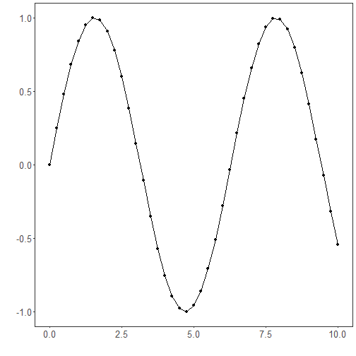
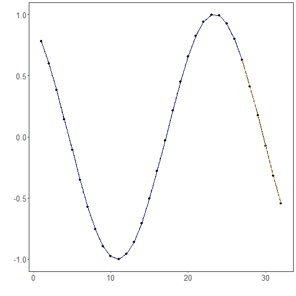

## WARMA Regression

About the method
- `ts_warma()` is a window-based ARMA-inspired regressor with local stepwise normalization.
- In `tspredit`, it acts as a sliding-window competitor that can combine local normalization with the package's regular preprocessing pipeline.

Didactic goal: show how a local window-based statistical competitor can be expressed inside the same `ts_regsw` workflow used by the other predictors.


``` r
source(url("https://raw.githubusercontent.com/cefet-rj-dal/tspredit/main/examples/seed.R"))
# Time Series Regression - WARMA

# Installing the package (if needed)
#install.packages("tspredit")
```

We start by loading the packages used throughout this example.


``` r
# Loading the packages
library(daltoolbox)
library(tspredit)
```

We load the same didactic series used in the other prediction examples and
materialize lagged windows.


``` r
# Series for study (generates sliding windows t9..t0)

data(tsd)
ts <- ts_data(tsd$y, 10)
ts_head(ts, 3)
```

```
##             t9        t8        t7        t6        t5        t4        t3        t2        t1        t0
## [1,] 0.0000000 0.2474040 0.4794255 0.6816388 0.8414710 0.9489846 0.9974950 0.9839859 0.9092974 0.7780732
## [2,] 0.2474040 0.4794255 0.6816388 0.8414710 0.9489846 0.9974950 0.9839859 0.9092974 0.7780732 0.5984721
## [3,] 0.4794255 0.6816388 0.8414710 0.9489846 0.9974950 0.9839859 0.9092974 0.7780732 0.5984721 0.3816610
```

Before training, we visualize the original series so the idea of local
window-based normalization can be compared against the raw signal.


``` r
# Original series visualization
library(ggplot2)
plot_ts(x = tsd$x, y = tsd$y) + theme(text = element_text(size = 16))
```



We now preserve the time order, split the data into train and test partitions,
and project the windows into inputs and targets.


``` r
# Train-test split and projection (X, y)

samp <- ts_sample(ts, test_size = 5)
io_train <- ts_projection(samp$train)
io_test <- ts_projection(samp$test)
```

On this didactic benchmark, using a delegated differencing step before the local
WARMA normalization gives a much fairer comparison with the ARIMA baseline. In
practice, the best simple configuration here is:

- `ts_norm_diff()` in the external pipeline
- `steps = 0` inside `ts_warma()`

This means the global differencing burden is handled explicitly by the package
pipeline, while WARMA still operates in the sliding-window lineage.


``` r
# External preprocessing used for delegated differencing

preproc <- ts_norm_diff()
```

We now train the WARMA model with the configuration that proved most compatible
with this benchmark.


``` r
# Training the WARMA model

model <- ts_warma(ts_norm_diff(), input_size = 4, steps = 0)
set_example_seed()
model <- fit(model, x = io_train$input, y = io_train$output)
```

We first evaluate the in-sample fit so the local normalization strategy can be
compared with the later recursive forecast.


``` r
# Fit evaluation (train)

adjust <- predict(model, io_train$input)
adjust <- as.vector(adjust)
output <- as.vector(io_train$output)
ev_adjust <- evaluate(model, output, adjust)
ev_adjust$mse
```

```
## [1] 6.636612e-32
```

We now generate a five-step forecast on the test segment and compare it with the
observed values.


``` r
# Forecast on test set (5 steps ahead)

prediction <- predict(model, x = io_test$input[1,], steps_ahead = 5)
prediction <- as.vector(prediction)
output <- as.vector(io_test$output)
ev_test <- evaluate(model, output, prediction)
ev_test
```

```
## $values
## [1]  0.41211849  0.17388949 -0.07515112 -0.31951919 -0.54402111
## 
## $prediction
## [1]  0.41211849  0.17388949 -0.07515112 -0.31951919 -0.54402111
## 
## $smape
## [1] 1.578894e-15
## 
## $mse
## [1] 1.556151e-31
## 
## $R2
## [1] 1
## 
## $metrics
##            mse        smape R2
## 1 1.556151e-31 1.578894e-15  1
```

The final plot compares the observed series, the training adjustment, and the
forecasted test horizon.


``` r
# Plot comparing actual vs fit (train) and forecast (test)

yvalues <- c(io_train$output, io_test$output)
plot_ts_pred(y = yvalues, yadj = adjust, ypre = prediction, color_prediction = "orange") + theme(text = element_text(size = 16))
```



What this example highlights
- `ts_warma()` stays inside the `ts_regsw` lineage even though its normalization logic is local and stepwise.
- The method can also be combined with delegated differencing from the package pipeline when that makes the benchmark more comparable to ARIMA.
- This makes it a useful statistical support model for univariate or target-centered multivariate forecasting.

References
- G. E. P. Box, G. M. Jenkins, G. C. Reinsel, and G. M. Ljung (2015). Time Series Analysis: Forecasting and Control. Wiley.
- E. Ogasawara, A. C. M. Pereira, G. F. R. Bernardes, A. A. F. Brandão, and M. P. de Albuquerque (2010). Adaptive normalization: A novel data normalization approach for non-stationary time series. The 2010 International Joint Conference on Neural Networks.
- Local WARMA manuscript used as implementation reference: `2026_04_SBBD_WARMA.pdf`.
