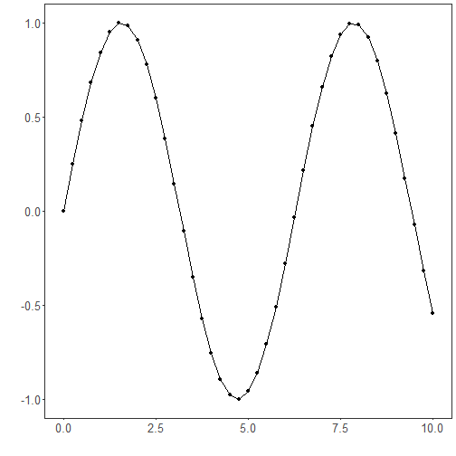
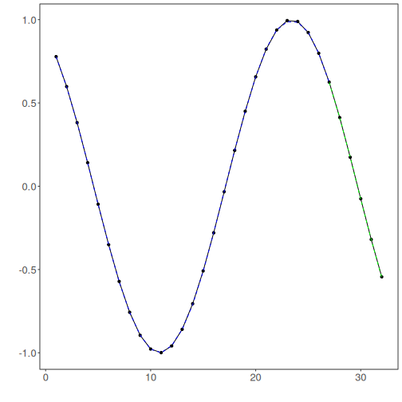

Conv1D: One-dimensional Convolutional Neural Networks (1D CNNs) extract local temporal patterns by convolving learnable filters across the input window. Stacked convolution and pooling layers can capture increasingly abstract features before a regression head maps to the next-step forecast. CNNs are effective when short- to mid-range motifs repeat over time and benefit from normalized inputs.

Objective: Train and evaluate a 1D CNN (Conv1D) for time-series forecasting with sliding windows, including normalization, fitting, and evaluation.


``` r
# Time Series Regression - 1D CNN (Conv1D)

# Installing packages (if needed)

#install.packages("tspredit")
```


``` r
# Loading the packages
library(daltoolbox)
library(daltoolboxdp)
library(tspredit)
```


``` r
# Series for study and sliding windows

data(tsd)
ts <- ts_data(tsd$y, 10)
ts_head(ts, 3)
```

```
##             t9        t8        t7        t6        t5        t4        t3        t2        t1        t0
## [1,] 0.0000000 0.2474040 0.4794255 0.6816388 0.8414710 0.9489846 0.9974950 0.9839859 0.9092974 0.7780732
## [2,] 0.2474040 0.4794255 0.6816388 0.8414710 0.9489846 0.9974950 0.9839859 0.9092974 0.7780732 0.5984721
## [3,] 0.4794255 0.6816388 0.8414710 0.9489846 0.9974950 0.9839859 0.9092974 0.7780732 0.5984721 0.3816610
```


``` r
# Series visualization
library(ggplot2)
plot_ts(x=tsd$x, y=tsd$y) + theme(text = element_text(size=16))
```




``` r
# Train-test split and projection (X, y)

samp <- ts_sample(ts, test_size = 5)
io_train <- ts_projection(samp$train)
io_test <- ts_projection(samp$test)
```


``` r
# Training the 1D CNN

model <- ts_conv1d(ts_norm_gminmax(), input_size=4, epochs=10000)
model <- fit(model, x=io_train$input, y=io_train$output)
```


``` r
# Fit evaluation (train)

adjust <- predict(model, io_train$input)
adjust <- as.vector(adjust)
output <- as.vector(io_train$output)
ev_adjust <- evaluate(model, output, adjust)
ev_adjust$mse
```

```
## [1] 1.035395e-05
```


``` r
# Forecast on test set

prediction <- predict(model, x=io_test$input[1,], steps_ahead=5)
prediction <- as.vector(prediction)
output <- as.vector(io_test$output)
ev_test <- evaluate(model, output, prediction)
ev_test
```

```
## $values
## [1]  0.41211849  0.17388949 -0.07515112 -0.31951919 -0.54402111
## 
## $prediction
## [1]  0.42088325  0.18209410 -0.06151295 -0.30330356 -0.53041492
## 
## $smape
## [1] 0.06882491
## 
## $mse
## [1] 0.0001556423
## 
## $R2
## [1] 0.9986557
## 
## $metrics
##            mse      smape        R2
## 1 0.0001556423 0.06882491 0.9986557
```


``` r
# Plot results

yvalues <- c(io_train$output, io_test$output)
plot_ts_pred(y=yvalues, yadj=adjust, ypre=prediction) + theme(text = element_text(size=16))
```



References
- Y. LeCun, L. Bottou, Y. Bengio, and P. Haffner (1998). Gradient-based learning applied to document recognition. Proceedings of the IEEE, 86(11), 2278–2324.
