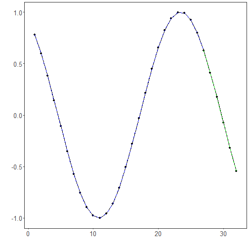

ELM: Extreme Learning Machines are single-hidden-layer feedforward networks where the input-to-hidden weights are randomly assigned and fixed; only the hidden-to-output weights are learned in closed form. This yields very fast training while retaining nonlinear modeling capacity via the hidden activation function. In time series, the lagged window acts as the input vector.

Objective: Fit and evaluate an ELM (Extreme Learning Machine) model for time-series forecasting with sliding windows, including data preparation, normalization, fitting, and visualization.


``` r
# Time Series Regression - ELM

# Installing the package (if needed)
#install.packages("tspredit")
```


``` r
# Loading the packages
library(daltoolbox)
library(tspredit) 
```


``` r
# Series for study and sliding windows

data(tsd)
ts <- ts_data(tsd$y, 10)
ts_head(ts, 3)
```

```
##             t9        t8        t7        t6        t5        t4        t3        t2        t1        t0
## [1,] 0.0000000 0.2474040 0.4794255 0.6816388 0.8414710 0.9489846 0.9974950 0.9839859 0.9092974 0.7780732
## [2,] 0.2474040 0.4794255 0.6816388 0.8414710 0.9489846 0.9974950 0.9839859 0.9092974 0.7780732 0.5984721
## [3,] 0.4794255 0.6816388 0.8414710 0.9489846 0.9974950 0.9839859 0.9092974 0.7780732 0.5984721 0.3816610
```


``` r
# Series visualization
library(ggplot2)
plot_ts(x=tsd$x, y=tsd$y) + theme(text = element_text(size=16))
```


``` r
# Train-test split and projection (X, y)

samp <- ts_sample(ts, test_size = 5)
io_train <- ts_projection(samp$train)
io_test <- ts_projection(samp$test)
```


``` r
# Preprocessing (global min-max normalization)

preproc <- ts_norm_gminmax()
```


``` r
# Training the ELM model

model <- ts_elm(ts_norm_gminmax(), input_size=4, nhid=3, actfun="purelin")
model <- fit(model, x=io_train$input, y=io_train$output)
```


``` r
# Fit evaluation (train)

adjust <- predict(model, io_train$input)
adjust <- as.vector(adjust)
output <- as.vector(io_train$output)
ev_adjust <- evaluate(model, output, adjust)
ev_adjust$mse
```

```
## [1] 2.484272e-27
```


``` r
# Forecast on test set

prediction <- predict(model, x=io_test$input[1,], steps_ahead=5)
prediction <- as.vector(prediction)
output <- as.vector(io_test$output)
ev_test <- evaluate(model, output, prediction)
ev_test
```

```
## $values
## [1]  0.41211849  0.17388949 -0.07515112 -0.31951919 -0.54402111
## 
## $prediction
## [1]  0.41211849  0.17388949 -0.07515112 -0.31951919 -0.54402111
## 
## $smape
## [1] 2.056052e-12
## 
## $mse
## [1] 3.464323e-25
## 
## $R2
## [1] 1
## 
## $metrics
##            mse        smape R2
## 1 3.464323e-25 2.056052e-12  1
```


``` r
# Plot results

yvalues <- c(io_train$output, io_test$output)
plot_ts_pred(y=yvalues, yadj=adjust, ypre=prediction) + theme(text = element_text(size=16))
```



References
- G.-B. Huang, Q.-Y. Zhu, and C.-K. Siew (2006). Extreme learning machine: Theory and applications. Neurocomputing, 70(1–3), 489–501.
