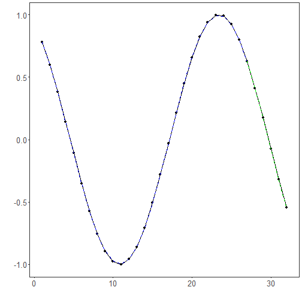

Objective: Demonstrate how to train, validate, and evaluate an MLP (Multilayer Perceptron) model for time-series forecasting with sliding windows, including data preparation, normalization, model fitting, and evaluation with metrics and plots.


``` r
# Time Series Regression - MLP

# Installing the package (if needed)
#install.packages("tspredit")
```


``` r
# Loading the packages
library(daltoolbox)
library(tspredit) 
```


``` r
# Series for study (generates sliding windows t9..t0)

data(tsd)
ts <- ts_data(tsd$y, 10)
ts_head(ts, 3)
```

```
##             t9        t8        t7        t6        t5        t4        t3        t2        t1        t0
## [1,] 0.0000000 0.2474040 0.4794255 0.6816388 0.8414710 0.9489846 0.9974950 0.9839859 0.9092974 0.7780732
## [2,] 0.2474040 0.4794255 0.6816388 0.8414710 0.9489846 0.9974950 0.9839859 0.9092974 0.7780732 0.5984721
## [3,] 0.4794255 0.6816388 0.8414710 0.9489846 0.9974950 0.9839859 0.9092974 0.7780732 0.5984721 0.3816610
```


``` r
# Original series visualization
library(ggplot2)
plot_ts(x=tsd$x, y=tsd$y) + theme(text = element_text(size=16))
```


``` r
# Train-test split and projection (X, y)

samp <- ts_sample(ts, test_size = 5)
io_train <- ts_projection(samp$train)
io_test <- ts_projection(samp$test)
```


``` r
# Preprocessing (global min-max normalization)

preproc <- ts_norm_gminmax()
```


``` r
# Training the MLP model

model <- ts_mlp(ts_norm_gminmax(), input_size=4, size=4, decay=0)
model <- fit(model, x=io_train$input, y=io_train$output)
```


``` r
# Fit evaluation (train)

adjust <- predict(model, io_train$input)
adjust <- as.vector(adjust)
output <- as.vector(io_train$output)
ev_adjust <- evaluate(model, output, adjust)
ev_adjust$mse
```

```
## [1] 1.433958e-05
```


``` r
# Forecast on test set (5 steps ahead)

prediction <- predict(model, x=io_test$input[1,], steps_ahead=5)
prediction <- as.vector(prediction)
output <- as.vector(io_test$output)
ev_test <- evaluate(model, output, prediction)
ev_test
```

```
## $values
## [1]  0.41211849  0.17388949 -0.07515112 -0.31951919 -0.54402111
## 
## $prediction
## [1]  0.41346700  0.17447608 -0.07724201 -0.32518290 -0.55250420
## 
## $smape
## [1] 0.01342357
## 
## $mse
## [1] 2.211495e-05
## 
## $R2
## [1] 0.999809
## 
## $metrics
##            mse      smape       R2
## 1 2.211495e-05 0.01342357 0.999809
```


``` r
# Plot comparing actual vs fit (train) and forecast (test)

yvalues <- c(io_train$output, io_test$output)
plot_ts_pred(y=yvalues, yadj=adjust, ypre=prediction) + theme(text = element_text(size=16))
```



