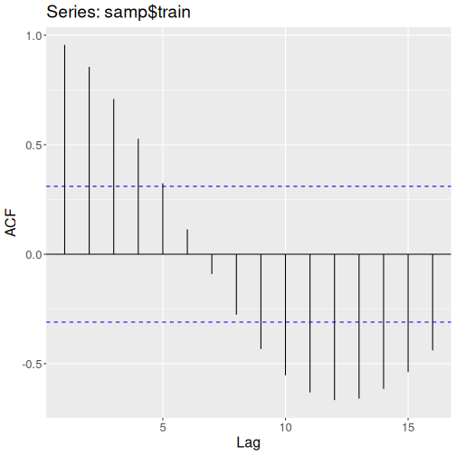
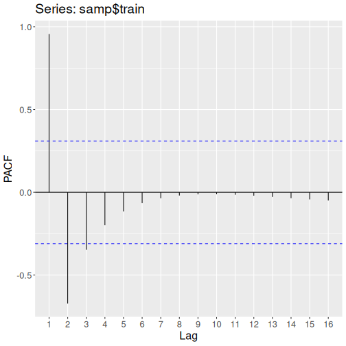
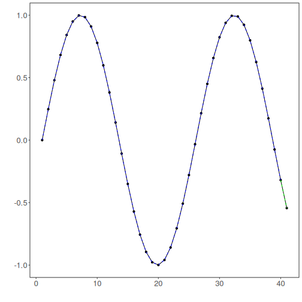

# Tutorial 01 - ARIMA for One-Step Prediction

This tutorial starts with the simplest forecasting scenario: predict the next observation only once.

It is the right starting point because it lets us focus on the forecasting protocol before adding extra components such as sliding windows, normalization, filters, or augmentation.

## Goal

Fit an ARIMA model and use it to forecast a single future observation from the most recent point available in the training set.


``` r
source(url("https://raw.githubusercontent.com/cefet-rj-dal/tspredit/main/examples/seed.R"))
# Load the package and the example series used throughout the tutorials.
library(daltoolbox)
library(forecast)
library(tspredit)
library(ggplot2)

data(tsd)
```

Before fitting the model, it is useful to look at the series we are about to forecast.


``` r
# Plot the original series to understand the overall pattern.
plot_ts(x = tsd$x, y = tsd$y) + theme(text = element_text(size = 16))
```


ARIMA operates directly on the univariate series, so we do not create sliding windows here. We keep the data in its sequential form.


``` r
# Wrap the raw series without a lag window.
ts <- ts_data(tsd$y, 1)
ts_head(ts, 5)
```

```
##             t0
## [1,] 0.0000000
## [2,] 0.2474040
## [3,] 0.4794255
## [4,] 0.6816388
## [5,] 0.8414710
```

To simulate forecasting, we reserve the last observation for testing and keep the earlier part for training.


``` r
# Keep the last point for out-of-sample evaluation.
samp <- ts_sample(ts, test_size = 1)
ts_head(samp$train, 3)
```

```
##             t0
## [1,] 0.0000000
## [2,] 0.2474040
## [3,] 0.4794255
```

``` r
ts_head(samp$test, 1)
```

```
##              t0
## [1,] -0.5440211
```

Before fitting the model, it is useful to inspect the correlation structure of the training signal. In this didactic series, the ACF decays slowly and the PACF suggests that a small autoregressive model with a few lags is a reasonable starting point.


``` r
# Inspect ACF and PACF on the training segment.
forecast::ggAcf(samp$train) + theme(text = element_text(size = 16))
```



``` r
forecast::ggPacf(samp$train) + theme(text = element_text(size = 16))
```



For presentation purposes, we therefore fit an explicit `ARIMA(5,0,0)` instead of letting `auto.arima()` collapse the example to an `AR(1)`.


``` r
# Fit an ARIMA with five autoregressive lags.
model <- ts_arima(p = 5, d = 0, q = 0)
set_example_seed()
model <- fit(model, x = samp$train)

attr(model, "params")
```

```
## $p
## [1] 5
## 
## $d
## [1] 0
## 
## $q
## [1] 0
## 
## $drift
## [1] FALSE
```

Before forecasting the held-out point, we inspect the in-sample fit. This gives us a quick idea of whether the model captured the training dynamics.


``` r
# Obtain one-step-ahead fitted values on the training portion.
adjust <- predict(model, samp$train)
adjust <- as.vector(adjust)

ev_adjust <- evaluate(model, as.vector(samp$train), adjust)
ev_adjust$metrics
```

```
##            mse      smape R2
## 1 1.977804e-10 0.05001045  1
```

The table reports three complementary metrics:

- `mse`: mean squared error, which grows quickly when the forecast misses by a large amount;
- `smape`: a relative error measure that is easier to compare across scales;
- `R2`: the fraction of variance explained relative to a constant-mean baseline.

For `R2`, values near `1` are better, `0` means “no better than predicting the mean”, and negative values mean the forecast is worse than that naive baseline.

It is also important to interpret the blue dashed line correctly: these are conditional one-step-ahead fitted values, not an interpolation of the observed series. Even with a better autoregressive order, the fitted curve is still a forecasting object, so some discrepancy around turning points is expected.

Now we generate the actual one-step-ahead forecast. Since we held out only one observation, the horizon is exactly one point.


``` r
# Forecast one step ahead from the last observed training point.
prediction <- predict(model, x = samp$test, steps_ahead = 1)
prediction <- as.vector(prediction)

output <- as.vector(samp$test)
ev_test <- evaluate(model, output, prediction)
ev_test
```

```
## $values
## [1] -0.5440211
## 
## $prediction
## [1] -0.5440215
## 
## $smape
## [1] 7.671266e-07
## 
## $mse
## [1] 1.74167e-13
## 
## $R2
## [1] NA
## 
## $metrics
##           mse        smape R2
## 1 1.74167e-13 7.671266e-07 NA
```

Finally, we plot the one-step fitted values on train and the one-step forecast on the held-out observation.


``` r
# Plot the one-step fitted segment and the forecasted point.
yvalues <- c(samp$train, samp$test)
plot_ts_pred(y = yvalues, yadj = adjust, ypre = prediction, color_prediction = "green") +
  theme(text = element_text(size = 16))
```



## Interpretation

In this protocol, the model is asked to do the easiest task possible: predict just the next value once.

That makes it a good reference point for the rest of the tutorial series. From here on, we will keep the same forecasting logic and only change the pipeline around it:

- separate train and test in time order;
- fit on the past only;
- forecast the future;
- evaluate the forecast against held-out observations.

For ARIMA specifically, remember that an in-sample fitted curve is still a forecasting object. It can therefore lag the observed signal near local peaks and valleys, especially when the autoregressive order is too low for the oscillatory structure of the series.


