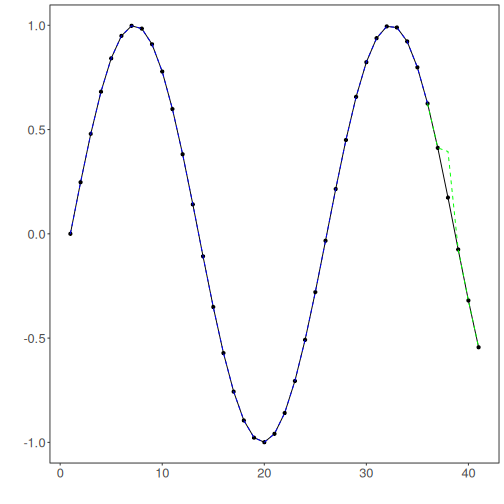

# Tutorial 02 - ARIMA for Rolling-Origin Evaluation

Forecasting a single point is useful, but it does not tell us how the model behaves when predictions need to be repeated over time.

Rolling-origin evaluation answers that question by asking for one-step forecasts repeatedly over a test segment.

## Goal

Fit an ARIMA model once and evaluate it in a rolling-origin, one-step-ahead setting.


``` r
source(url("https://raw.githubusercontent.com/cefet-rj-dal/tspredit/main/examples/seed.R"))
# Load package and example data.
library(daltoolbox)
library(tspredit)
library(ggplot2)

data(tsd)
```

We start from the same series used in the first tutorial.


``` r
# Visualize the series before splitting it.
plot_ts(x = tsd$x, y = tsd$y) + theme(text = element_text(size = 16))
```


As before, ARIMA uses the raw series instead of sliding windows.


``` r
# Keep the series as a single ordered sequence.
ts <- ts_data(tsd$y, 1)
```

This time we reserve a longer test segment. Each point in that segment will be predicted one step ahead in sequence.


``` r
# Reserve the last five observations for rolling-origin evaluation.
samp <- ts_sample(ts, test_size = 5)
ts_head(samp$train, 3)
```

```
##             t0
## [1,] 0.0000000
## [2,] 0.2474040
## [3,] 0.4794255
```

``` r
ts_head(samp$test, 3)
```

```
##               t0
## [1,]  0.41211849
## [2,]  0.17388949
## [3,] -0.07515112
```

Now we train the ARIMA model using the training portion only.


``` r
# Fit ARIMA on the training data.
model <- ts_arima(p = 5, d = 0, q = 0)
set_example_seed()
model <- fit(model, x = samp$train)
```

For rolling-origin evaluation with `ts_arima()`, we pass the whole test segment and set `steps_ahead = 1`. Internally, the model predicts one point, appends the observed value, and repeats.


``` r
# Predict one step at a time across the test horizon.
prediction <- predict(model, x = samp$test, steps_ahead = 1)
prediction <- as.vector(prediction)

output <- as.vector(samp$test)
ev_test <- evaluate(model, output, prediction)
ev_test
```

```
## $values
## [1]  0.41211849  0.17388949 -0.07515112 -0.31951919 -0.54402111
## 
## $prediction
## [1]  0.41211881  0.39475240 -0.07514989 -0.31951908 -0.54402153
## 
## $smape
## [1] 0.1553653
## 
## $mse
## [1] 0.009756086
## 
## $R2
## [1] 0.9157362
## 
## $metrics
##           mse     smape        R2
## 1 0.009756086 0.1553653 0.9157362
```

A side-by-side table helps us inspect where the rolling forecasts stayed close to the observed values and where they drifted away.


``` r
# Compare observed and predicted values over the rolling horizon.
data.frame(
  step = seq_along(output),
  observed = output,
  predicted = prediction
)
```

```
##   step    observed   predicted
## 1    1  0.41211849  0.41211881
## 2    2  0.17388949  0.39475240
## 3    3 -0.07515112 -0.07514989
## 4    4 -0.31951919 -0.31951908
## 5    5 -0.54402111 -0.54402153
```

We can also visualize the adjustment on train and the rolling forecasts on the final test block.


``` r
# Plot fitted values and rolling-origin predictions.
adjust <- as.vector(predict(model, samp$train))
yvalues <- c(samp$train, samp$test)

plot_ts_pred(y = yvalues, yadj = adjust, ypre = prediction, color_prediction = "green") +
  theme(text = element_text(size = 16))
```



## Interpretation

Rolling-origin evaluation is stricter than predicting a single point because the model has to remain useful over multiple forecast updates.

This is often closer to operational use than a single one-step forecast:

- monitor tomorrow's value every day;
- update the forecast as new observations arrive;
- measure whether short-horizon accuracy is stable over time.


