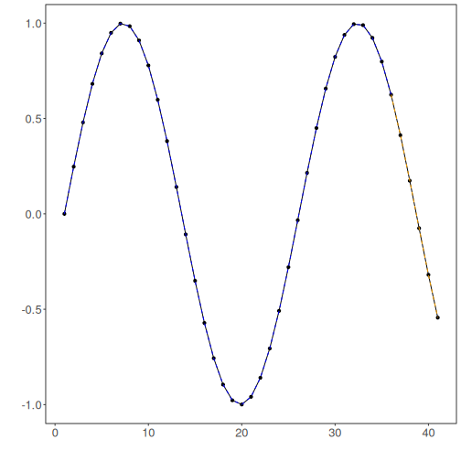

# Tutorial 03 - ARIMA for Multiple Steps Ahead

The next scenario is a direct multi-step forecast: instead of updating the model after each new observed value, we ask for several future values at once.

This protocol is common when planning depends on a fixed future horizon rather than on repeated short-term updates.

## Goal

Fit an ARIMA model and forecast multiple future observations ahead from the end of the training segment.


``` r
source(url("https://raw.githubusercontent.com/cefet-rj-dal/tspredit/main/examples/seed.R"))
# Load package and example data.
library(daltoolbox)
library(tspredit)
library(ggplot2)

data(tsd)
```

We begin by visualizing the series and preparing it as a raw sequence, just as in the previous ARIMA tutorials.


``` r
# Plot the full series.
plot_ts(x = tsd$x, y = tsd$y) + theme(text = element_text(size = 16))
```


``` r
# Build the series object without sliding windows.
ts <- ts_data(tsd$y, 1)
```

We will forecast the last five observations in one shot.


``` r
# Reserve the final five observations for a multi-step-ahead forecast.
samp <- ts_sample(ts, test_size = 5)
ts_head(samp$train, 3)
```

```
##             t0
## [1,] 0.0000000
## [2,] 0.2474040
## [3,] 0.4794255
```

``` r
ts_head(samp$test, 3)
```

```
##               t0
## [1,]  0.41211849
## [2,]  0.17388949
## [3,] -0.07515112
```

Next, we fit ARIMA on the training data.


``` r
# Fit the ARIMA model.
model <- ts_arima(p = 5, d = 0, q = 0)
set_example_seed()
model <- fit(model, x = samp$train)
```

Now we ask for five steps ahead directly. In this mode, the model projects forward without observing the intermediate true values.


``` r
# Forecast five future values directly from the trained model.
prediction <- predict(model, x = samp$test[1], steps_ahead = 5)
prediction <- as.vector(prediction)

output <- as.vector(samp$test)
ev_test <- evaluate(model, output, prediction)
ev_test
```

```
## $values
## [1]  0.41211849  0.17388949 -0.07515112 -0.31951919 -0.54402111
## 
## $prediction
## [1]  0.41211881  0.17388946 -0.07515026 -0.31951936 -0.54401966
## 
## $smape
## [1] 3.10581e-06
## 
## $mse
## [1] 5.935781e-13
## 
## $R2
## [1] 1
## 
## $metrics
##            mse       smape R2
## 1 5.935781e-13 3.10581e-06  1
```

It is useful to compare the forecasted trajectory against the true held-out values.


``` r
# Show the five-step-ahead forecast next to the observed horizon.
data.frame(
  step = seq_along(output),
  observed = output,
  predicted = prediction
)
```

```
##   step    observed   predicted
## 1    1  0.41211849  0.41211881
## 2    2  0.17388949  0.17388946
## 3    3 -0.07515112 -0.07515026
## 4    4 -0.31951919 -0.31951936
## 5    5 -0.54402111 -0.54401966
```

The plot below highlights the difference between in-sample fit and direct future projection.


``` r
# Plot training adjustment and direct multi-step forecast.
adjust <- as.vector(predict(model, samp$train))
yvalues <- c(samp$train, samp$test)

plot_ts_pred(y = yvalues, yadj = adjust, ypre = prediction, color_prediction = "orange") +
  theme(text = element_text(size = 16))
```



## Interpretation

Compared with rolling-origin evaluation, multi-step forecasting is harder because forecast errors can accumulate along the horizon.

This protocol is especially relevant when:

- the future horizon must be known in advance;
- intermediate observations will not be available soon enough;
- planning depends on a block of future values instead of only the next one.


