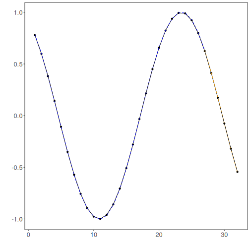

# Tutorial 05 - Comparing Normalization Strategies for MLP

Normalization is often decisive for neural forecasting models. A global scale can work well when the series is stable, while adaptive scaling can be more useful when the distribution drifts over time.

This tutorial compares both approaches on the same MLP configuration so that the effect of normalization stays visible.

## Goal

Compare `ts_norm_gminmax()` and `ts_norm_an()` using the same MLP architecture and the same train/test split.


``` r
source(url("https://raw.githubusercontent.com/cefet-rj-dal/tspredit/main/examples/seed.R"))
# Load package and example data.
library(daltoolbox)
library(tspredit)
library(ggplot2)

set_example_seed(123L)
data(tsd)
```

We start exactly as in the baseline MLP tutorial so that the comparison is fair.


``` r
# Build sliding windows and preserve time order in the split.
ts <- ts_data(tsd$y, 10)
samp <- ts_sample(ts, test_size = 5)
io_train <- ts_projection(samp$train)
io_test <- ts_projection(samp$test)
```

The helper function below trains the same MLP with a chosen preprocessing object and returns both metrics and predictions.


``` r
# Fit the same MLP pipeline with a chosen normalization strategy.
run_mlp <- function(preprocess, label) {
  model <- ts_mlp(
    preprocess = preprocess,
    input_size = 4,
    size = 4,
    decay = 0,
    maxit = 1000
  )

set_example_seed()
  model <- fit(model, x = io_train$input, y = io_train$output)

  adjust <- as.vector(predict(model, io_train$input))
  prediction <- as.vector(predict(model, x = io_test$input[1:1, ], steps_ahead = 5))

  list(
    label = label,
    model = model,
    adjust = adjust,
    prediction = prediction,
    train_metrics = evaluate(model, as.vector(io_train$output), adjust)$metrics,
    test_metrics = evaluate(model, as.vector(io_test$output), prediction)$metrics
  )
}
```

First, we run the baseline with global min-max normalization.


``` r
# Train the model with global min-max normalization.
res_gminmax <- run_mlp(ts_norm_gminmax(), "global min-max")
res_gminmax$test_metrics
```

```
##            mse      smape       R2
## 1 0.0001001462 0.06058831 0.999135
```

Now we repeat the experiment with adaptive normalization.


``` r
# Train the same model with adaptive normalization.
res_an <- run_mlp(ts_norm_an(), "adaptive normalization")
res_an$test_metrics
```

```
##            mse       smape        R2
## 1 7.138197e-06 0.006005058 0.9999383
```

To make the comparison easy to inspect, we place the test metrics side by side.


``` r
# Compare the test metrics for the two normalization choices.
rbind(
  cbind(model = res_gminmax$label, res_gminmax$test_metrics),
  cbind(model = res_an$label, res_an$test_metrics)
)
```

```
##                    model          mse       smape        R2
## 1         global min-max 1.001462e-04 0.060588308 0.9991350
## 2 adaptive normalization 7.138197e-06 0.006005058 0.9999383
```

The next table compares the actual forecasted values across the two pipelines.


``` r
# Compare the two forecast trajectories against the observed horizon.
data.frame(
  step = 1:5,
  observed = as.vector(io_test$output),
  pred_gminmax = res_gminmax$prediction,
  pred_an = res_an$prediction
)
```

```
##   step    observed pred_gminmax    pred_an
## 1    1  0.41211849   0.41787725  0.4154049
## 2    2  0.17388949   0.18362848  0.1745594
## 3    3 -0.07515112  -0.06273766 -0.0748118
## 4    4 -0.31951919  -0.30699150 -0.3178584
## 5    5 -0.54402111  -0.53616730 -0.5486652
```

Finally, we visualize the adaptive-normalization forecast to connect the metrics with the resulting trajectory.


``` r
# Plot one of the compared forecasts to inspect the trajectory.
yvalues <- c(io_train$output, io_test$output)
plot_ts_pred(y = yvalues, yadj = res_an$adjust, ypre = res_an$prediction, color_prediction = "orange") +
  theme(text = element_text(size = 16))
```



## Interpretation

This tutorial isolates a single pipeline decision: the normalization strategy.

That isolation is important because it helps answer a practical question without changing the model architecture at the same time:

- should the model learn from a fixed global scale;
- or should it adapt its notion of scale over time?

In later tutorials, we will keep using this same idea of changing one component at a time.

