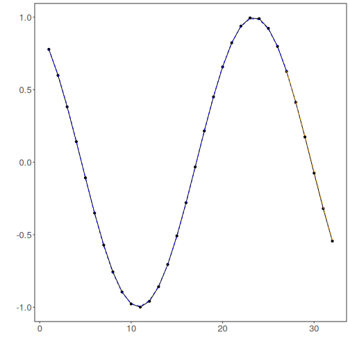

# Tutorial 06 - MLP with Filtering Before Prediction

Some time series contain short-term irregularities that make learning harder than necessary. In those cases, a filter can be applied before the forecasting model is trained.

This tutorial shows that idea using a simple smoothing filter before building the MLP pipeline.

## Goal

Apply a filter to the original series, then build the MLP forecasting workflow on the filtered signal.


``` r
source(url("https://raw.githubusercontent.com/cefet-rj-dal/tspredit/main/examples/seed.R"))
# Load packages and the example data.
library(daltoolbox)
library(tspredit)
library(ggplot2)

set_example_seed(123L)
data(tsd)
```

We first plot the original signal, because the next step will replace it with a smoothed version.


``` r
# Plot the original series.
plot_ts(x = tsd$x, y = tsd$y) + theme(text = element_text(size = 16))
```


Now we apply a smoothing filter to the full series. This tutorial uses `ts_fil_smooth()` because it is easy to interpret and highlights the role of filtering in the pipeline.


``` r
# Filter the original series before creating the supervised-learning windows.
filter_model <- ts_fil_smooth()
set_example_seed()
filter_model <- fit(filter_model, tsd$y)
y_filtered <- transform(filter_model, tsd$y)
```

It is useful to inspect how much the filtered series differs from the original one before fitting any forecasting model.


``` r
# Compare the original and filtered series.
plot_ts_pred(y = tsd$y, yadj = y_filtered) + theme(text = element_text(size = 16))
```


With the filtered series ready, we now build the sliding windows and preserve the time order in the split.


``` r
# Build the forecasting dataset from the filtered signal.
ts_filtered <- ts_data(y_filtered, 10)
samp <- ts_sample(ts_filtered, test_size = 5)
io_train <- ts_projection(samp$train)
io_test <- ts_projection(samp$test)
```

The MLP configuration stays simple so that the main change in this tutorial is clearly the filter, not the model itself.


``` r
# Fit a baseline MLP on the filtered series.
model <- ts_mlp(
  preprocess = ts_norm_gminmax(),
  input_size = 4,
  size = 4,
  decay = 0,
  maxit = 1000
)

set_example_seed()
model <- fit(model, x = io_train$input, y = io_train$output)
```

We evaluate both the training adjustment and the forecasted test horizon.


``` r
# Evaluate fit on train and forecast on the test block.
adjust <- as.vector(predict(model, io_train$input))
prediction <- as.vector(predict(model, x = io_test$input[1:1, ], steps_ahead = 5))

train_metrics <- evaluate(model, as.vector(io_train$output), adjust)$metrics
test_metrics <- evaluate(model, as.vector(io_test$output), prediction)$metrics

train_metrics
```

```
##            mse       smape        R2
## 1 1.432577e-05 0.008313728 0.9999712
```

``` r
test_metrics
```

```
##            mse      smape       R2
## 1 0.0001001462 0.06058831 0.999135
```

The plot below shows the final forecasting behavior on the filtered series.


``` r
# Plot the MLP fit and forecast after filtering.
yvalues <- c(io_train$output, io_test$output)
plot_ts_pred(y = yvalues, yadj = adjust, ypre = prediction, color_prediction = "orange") +
  theme(text = element_text(size = 16))
```



## Interpretation

This workflow changes the signal before modeling. That can help when noise dominates the local dynamics, but it can also remove information that the model would otherwise use.

The practical lesson is:

- filtering is not automatically beneficial;
- it should be treated as an explicit modeling decision;
- it makes sense to compare filtered and unfiltered pipelines on the same protocol.

