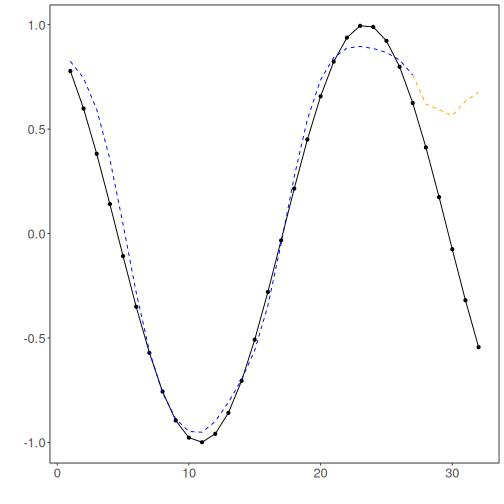

# Tutorial 07 - MLP with Data Augmentation

Augmentation is useful when we want the model to learn from a richer set of training windows without touching the future test segment.

In this tutorial, we augment the training data only, then fit the same MLP forecasting pipeline.

## Goal

Use `ts_aug_jitter()` to enlarge the training set before fitting the MLP model.


``` r
source(url("https://raw.githubusercontent.com/cefet-rj-dal/tspredit/main/examples/seed.R"))
# Load packages and example data.
library(daltoolbox)
library(tspredit)
library(ggplot2)

set_example_seed(123L)
data(tsd)
```

We start by creating the baseline sliding-window dataset.


``` r
# Build sliding windows from the original series.
ts <- ts_data(tsd$y, 10)
samp <- ts_sample(ts, test_size = 5)
```

Before augmenting anything, we separate the train and test windows. This is important because augmentation should affect training only.


``` r
# Split the data in time order before augmentation.
train_ts <- samp$train
test_ts <- samp$test

io_train <- ts_projection(train_ts)
io_test <- ts_projection(test_ts)
```

The augmentation operator works on the windowed dataset. We fit it on the training windows and then transform only the training portion.


``` r
# Augment the training windows with jitter.
augment_model <- ts_aug_jitter()
set_example_seed()
augment_model <- fit(augment_model, train_ts)

train_aug <- transform(augment_model, train_ts)
train_aug <- adjust_ts_data(train_aug)
io_train_aug <- ts_projection(train_aug)
```

The next lines show how much the training set grew after augmentation.


``` r
# Compare the original and augmented training sizes.
data.frame(
  original_train_rows = nrow(train_ts),
  augmented_train_rows = nrow(train_aug)
)
```

```
##   original_train_rows augmented_train_rows
## 1                  27                   54
```

Now we fit the MLP using the augmented training windows.


``` r
# Fit the MLP on the augmented training set.
model <- ts_mlp(
  preprocess = ts_norm_gminmax(),
  input_size = 4,
  size = 4,
  decay = 0,
  maxit = 1000
)

set_example_seed()
model <- fit(model, x = io_train_aug$input, y = io_train_aug$output)
```

We evaluate the resulting model on the untouched future test horizon.


``` r
# Forecast the test block without augmenting test data.
prediction <- as.vector(predict(model, x = io_test$input[1:1, ], steps_ahead = 5))
output <- as.vector(io_test$output)

ev_test <- evaluate(model, output, prediction)
ev_test
```

```
## $values
## [1]  0.41211849  0.17388949 -0.07515112 -0.31951919 -0.54402111
## 
## $prediction
## [1] 0.6191626 0.5922642 0.5642638 0.6341227 0.6769353
## 
## $smape
## [1] 1.498734
## 
## $mse
## [1] 0.6053847
## 
## $R2
## [1] -4.228739
## 
## $metrics
##         mse    smape        R2
## 1 0.6053847 1.498734 -4.228739
```

To better understand the result, it is helpful to compare the forecast values directly.


``` r
# Inspect the forecasted test horizon.
data.frame(
  step = 1:5,
  observed = output,
  predicted = prediction
)
```

```
##   step    observed predicted
## 1    1  0.41211849 0.6191626
## 2    2  0.17388949 0.5922642
## 3    3 -0.07515112 0.5642638
## 4    4 -0.31951919 0.6341227
## 5    5 -0.54402111 0.6769353
```

We finish with a plot of the fitted values on the original training horizon and the forecast trajectory over the untouched test block.


``` r
# Plot the fit on the original train horizon and the forecast on test.
adjust <- as.vector(predict(model, io_train$input))
yvalues <- c(io_train$output, io_test$output)

plot_ts_pred(y = yvalues, yadj = adjust, ypre = prediction, color_prediction = "orange") +
  theme(text = element_text(size = 16))
```



## Interpretation

The key point in this tutorial is not the specific augmentation technique, but the pipeline logic:

- augment training windows only;
- keep the future horizon untouched;
- evaluate whether the extra diversity helps generalization.

