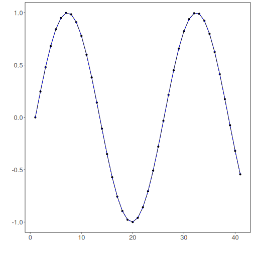
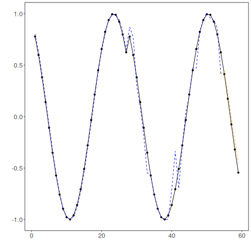

# Tutorial 08 - Complete MLP Pipeline

At this point, we have explored the baseline MLP, normalization choices, filtering, and augmentation separately.

This tutorial combines those elements in a single end-to-end workflow so the reader can see how the pieces interact in practice.

## Goal

Build an MLP pipeline with:

- filtering before window construction;
- augmentation on training windows only;
- adaptive normalization inside the model.


``` r
source(url("https://raw.githubusercontent.com/cefet-rj-dal/tspredit/main/examples/seed.R"))
# Load package and example data.
library(daltoolbox)
library(tspredit)
library(ggplot2)

set_example_seed(123L)
data(tsd)
```

The first stage is to filter the original series so that the supervised-learning windows are built from the transformed signal.


``` r
# Filter the original series before creating lag windows.
filter_model <- ts_fil_smooth()
set_example_seed()
filter_model <- fit(filter_model, tsd$y)
y_filtered <- transform(filter_model, tsd$y)
```

The next plot shows the original and filtered series together.


``` r
# Visualize the filtering effect before moving on.
plot_ts_pred(y = tsd$y, yadj = y_filtered) + theme(text = element_text(size = 16))
```



With the filtered series ready, we create sliding windows and split them in time order.


``` r
# Build windows and split the filtered series into train and test.
ts_filtered <- ts_data(y_filtered, 10)
samp <- ts_sample(ts_filtered, test_size = 5)

train_ts <- samp$train
test_ts <- samp$test
```

Before fitting the forecasting model, we augment the training windows only. This keeps the test horizon untouched while enriching the learning set.


``` r
# Apply augmentation only to the training windows.
augment_model <- ts_aug_jitter()
set_example_seed()
augment_model <- fit(augment_model, train_ts)

train_aug <- transform(augment_model, train_ts)
train_aug <- adjust_ts_data(train_aug)

io_train <- ts_projection(train_aug)
io_test <- ts_projection(test_ts)
```

Now we fit the MLP with adaptive normalization, so the model receives a richer and more flexible preprocessing pipeline.


``` r
# Fit the MLP with adaptive normalization on the augmented training windows.
model <- ts_mlp(
  preprocess = ts_norm_an(),
  input_size = 4,
  size = 4,
  decay = 0,
  maxit = 1000
)

set_example_seed()
model <- fit(model, x = io_train$input, y = io_train$output)
```

We inspect the training adjustment first, then the out-of-sample forecast.


``` r
# Evaluate fit on the augmented training set.
adjust <- as.vector(predict(model, io_train$input))
ev_adjust <- evaluate(model, as.vector(io_train$output), adjust)
ev_adjust$metrics
```

```
##           mse    smape        R2
## 1 0.007208915 0.148213 0.9855097
```


``` r
# Forecast the final test horizon with the complete pipeline.
prediction <- as.vector(predict(model, x = io_test$input[1:1, ], steps_ahead = 5))
output <- as.vector(io_test$output)

ev_test <- evaluate(model, output, prediction)
ev_test
```

```
## $values
## [1]  0.41211849  0.17388949 -0.07515112 -0.31951919 -0.54402111
## 
## $prediction
## [1]  0.442244409  0.225089441 -0.009678268 -0.235257572 -0.451724613
## 
## $smape
## [1] 0.4719926
## 
## $mse
## [1] 0.004686873
## 
## $R2
## [1] 0.9595192
## 
## $metrics
##           mse     smape        R2
## 1 0.004686873 0.4719926 0.9595192
```

A direct table makes it easier to inspect the five-step forecast.


``` r
# Compare observed and predicted values for the final horizon.
data.frame(
  step = 1:5,
  observed = output,
  predicted = prediction
)
```

```
##   step    observed    predicted
## 1    1  0.41211849  0.442244409
## 2    2  0.17388949  0.225089441
## 3    3 -0.07515112 -0.009678268
## 4    4 -0.31951919 -0.235257572
## 5    5 -0.54402111 -0.451724613
```

Finally, we plot the result of the complete workflow.


``` r
# Plot the fit and forecast produced by the complete MLP pipeline.
yvalues <- c(io_train$output, io_test$output)
plot_ts_pred(y = yvalues, yadj = adjust, ypre = prediction, color_prediction = "orange") +
  theme(text = element_text(size = 16))
```



## Interpretation

This is the first tutorial where the full pipeline logic becomes explicit:

- transform the signal before modeling;
- enlarge the training set;
- normalize inputs in a model-aware way;
- fit the regressor and forecast the future.

This is also a good point to ask whether the extra complexity is worth it. The next tutorial addresses that question by comparing model families directly.

