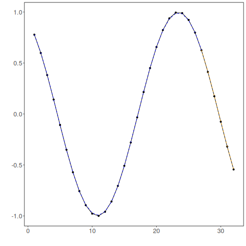

# Tutorial 10 - Integrated Tuning

The previous tutorials changed one component at a time so that the role of each design choice would stay clear.

Now that the pieces are familiar, we can let the package search over several of them automatically.

## Goal

Use `ts_integtune()` to tune:

- input size;
- normalization strategy;
- augmentation strategy;
- MLP hyperparameters.


``` r
source(url("https://raw.githubusercontent.com/cefet-rj-dal/tspredit/main/examples/seed.R"))
# Load packages and the example dataset.
library(daltoolbox)
library(tspredit)
library(ggplot2)

set_example_seed(123L)
data(tsd)
```

We begin with the same windowed forecasting dataset used in the MLP tutorials.


``` r
# Create sliding windows and preserve time order in the split.
ts <- ts_data(tsd$y, 10)
samp <- ts_sample(ts, test_size = 5)

io_train <- ts_projection(samp$train)
io_test <- ts_projection(samp$test)
```

Before fitting the tuner, we define the search space. The goal is not to search everything possible, but to compare a small set of meaningful alternatives.


``` r
# Define the integrated search space.
tune <- ts_integtune(
  input_size = 3:5,
  base_model = ts_mlp(),
  folds = 3,
  preprocess = list(ts_norm_gminmax(), ts_norm_an()),
  augment = list(ts_aug_none(), ts_aug_jitter()),
  ranges = list(
    size = 2:4,
    decay = c(0, 0.01),
    maxit = c(500)
  )
)
```

Now we fit the integrated tuner on the training data. Internally, it evaluates combinations of input size, normalization, augmentation, and model hyperparameters.


``` r
# Fit the integrated tuning process.
set_example_seed()
model <- fit(tune, x = io_train$input, y = io_train$output)
```

After tuning, the fitted model stores the best configuration that was selected.


``` r
# Inspect the best configuration found by the tuner.
attr(model, "params")
```

```
## $input_size
## [1] 4
## 
## $preprocess
## [1] "ts_norm_gminmax"
## 
## $augment
## [1] "ts_aug_none"
## 
## $size
## [1] 3
## 
## $decay
## [1] 0
## 
## $maxit
## [1] 500
## 
## $key
## [1] 14
## 
## attr(,"out.attrs")
## attr(,"out.attrs")$dim
## input_size preprocess    augment       size      decay      maxit 
##          3          2          2          3          2          1 
## 
## attr(,"out.attrs")$dimnames
## attr(,"out.attrs")$dimnames$input_size
## [1] "input_size=3" "input_size=4" "input_size=5"
## 
## attr(,"out.attrs")$dimnames$preprocess
## [1] "preprocess=ts_norm_gminmax" "preprocess=ts_norm_an"     
## 
## attr(,"out.attrs")$dimnames$augment
## [1] "augment=ts_aug_none"   "augment=ts_aug_jitter"
## 
## attr(,"out.attrs")$dimnames$size
## [1] "size=2" "size=3" "size=4"
## 
## attr(,"out.attrs")$dimnames$decay
## [1] "decay=0.00" "decay=0.01"
## 
## attr(,"out.attrs")$dimnames$maxit
## [1] "maxit=500"
```

The next object records the evaluated combinations and their errors.


``` r
# Inspect the tuning table generated during the search.
head(attr(model, "hyperparameters"))
```

```
##   input_size      preprocess     augment size decay maxit key        error msg
## 1          3 ts_norm_gminmax ts_aug_none    2     0   500   1 2.101521e-05    
## 2          4 ts_norm_gminmax ts_aug_none    2     0   500   2 2.842284e-05    
## 3          5 ts_norm_gminmax ts_aug_none    2     0   500   3 2.254544e-05    
## 4          3      ts_norm_an ts_aug_none    2     0   500   4 4.119861e-04    
## 5          4      ts_norm_an ts_aug_none    2     0   500   5 3.689758e-04    
## 6          5      ts_norm_an ts_aug_none    2     0   500   6 1.430516e-04
```

Once the tuned pipeline has been selected, we forecast the held-out horizon exactly as in the earlier MLP tutorials.


``` r
# Forecast the final five-step horizon with the tuned pipeline.
prediction <- as.vector(predict(model, x = io_test$input[1:1, ], steps_ahead = 5))
output <- as.vector(io_test$output)

ev_test <- evaluate(model, output, prediction)
ev_test
```

```
## $values
## [1]  0.41211849  0.17388949 -0.07515112 -0.31951919 -0.54402111
## 
## $prediction
## [1]  0.41597902  0.17798556 -0.07123254 -0.31749905 -0.54621717
## 
## $smape
## [1] 0.01930299
## 
## $mse
## [1] 1.118812e-05
## 
## $R2
## [1] 0.9999034
## 
## $metrics
##            mse      smape        R2
## 1 1.118812e-05 0.01930299 0.9999034
```

We also inspect the in-sample adjustment, because a tuned model should still produce a coherent fit on the training data.


``` r
# Evaluate the tuned model on the training data.
adjust <- as.vector(predict(model, io_train$input))
ev_adjust <- evaluate(model, as.vector(io_train$output), adjust)
ev_adjust$metrics
```

```
##            mse       smape        R2
## 1 1.374045e-05 0.008416788 0.9999724
```

The final plot connects the selected pipeline to the resulting forecast trajectory.


``` r
# Plot the tuned fit and forecast.
yvalues <- c(io_train$output, io_test$output)
plot_ts_pred(y = yvalues, yadj = adjust, ypre = prediction, color_prediction = "orange") +
  theme(text = element_text(size = 16))
```



## Interpretation

Integrated tuning is useful when manual comparison becomes repetitive or too large to manage consistently.

It is best used after understanding the components individually, because then the search space becomes easier to define and interpret.

One important detail is that the current integrated tuner focuses on:

- preprocessing;
- augmentation;
- input size;
- model hyperparameters.

If you also want filtering, the filter should still be applied upstream as a separate preprocessing decision before the tuning stage.

