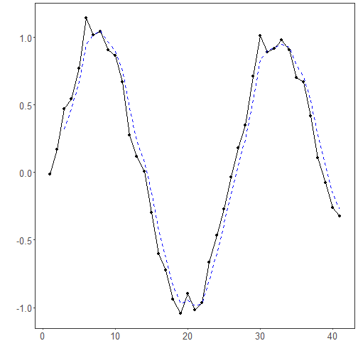

Objetivo: Aplicar a média móvel exponencial (EMA) para suavizar a série, reduzindo flutuações rápidas e mantendo a tendência.


``` r
# Filtro - Média Móvel Exponencial (EMA)

# Instalando o pacote (se necessário)
install.packages("tspredit")
```


``` r
# Carregando os pacotes
library(daltoolbox)
library(tspredit) 
```


``` r
# Série para estudo com ruído artificial e picos

data(tsd)
y <- tsd$y
noise <- rnorm(length(y), 0, sd(y)/10)
spike <- rnorm(1, 0, sd(y))
tsd$y <- tsd$y + noise
tsd$y[10] <- tsd$y[10] + spike
tsd$y[20] <- tsd$y[20] + spike
tsd$y[30] <- tsd$y[30] + spike
```


``` r
library(ggplot2)
# Visualização da série ruidosa
plot_ts(x=tsd$x, y=tsd$y) + theme(text = element_text(size=16))
```


``` r
# Aplicando o filtro EMA

filter <- ts_fil_ema(3)
filter <- fit(filter, tsd$y)
y <- transform(filter, tsd$y)
plot_ts_pred(y=tsd$y, yadj=y) + theme(text = element_text(size=16))
```

```
## Warning: Removed 2 rows containing missing values or values outside the scale range (`geom_line()`).
```


