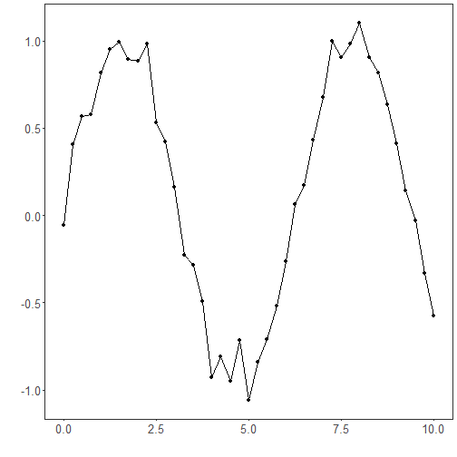
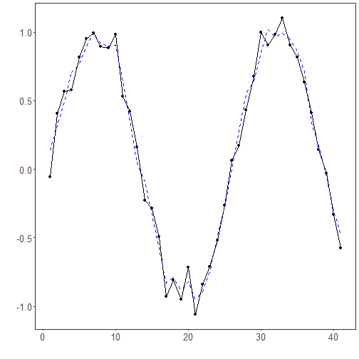

EMD filter: EMD iteratively extracts IMFs by sifting: local extrema define upper and lower envelopes whose mean is subtracted from the signal until the residual becomes an IMF; the process repeats on the remainder. Denoising is obtained by summing low‑frequency IMFs and the residual while attenuating high‑frequency IMFs.

Considerations
- EMD is adaptive and data-driven (no fixed basis), suitable for nonlinear and nonstationary signals.
- End effects can occur; visual checks are recommended near boundaries.

Objective: Empirical Mode Decomposition (EMD) decomposes a signal into a finite set of intrinsic mode functions (IMFs) derived directly from the data. By reconstructing the series from selected IMFs, you can suppress high-frequency noise and preserve meaningful structure.


``` r
# Filter - EMD

# Install tspredit if needed
#install.packages("tspredit")
```


``` r
# Load packages
library(daltoolbox)
library(tspredit) 
```


``` r
# Prepare a noisy series example
data(tsd)
y <- tsd$y
noise <- rnorm(length(y), 0, sd(y)/10)
spike <- rnorm(1, 0, sd(y))
tsd$y <- tsd$y + noise
tsd$y[10] <- tsd$y[10] + spike
tsd$y[20] <- tsd$y[20] + spike
tsd$y[30] <- tsd$y[30] + spike
```


``` r
library(ggplot2)
# Visualize the noisy input
plot_ts(x=tsd$x, y=tsd$y) + theme(text = element_text(size=16))
```




``` r
# Apply EMD-based filtering (IMF reconstruction)

filter <- ts_fil_emd()          # decompose into IMFs
filter <- fit(filter, tsd$y)    # compute decomposition
y <- transform(filter, tsd$y)   # reconstruct a denoised version

# Compare original vs reconstructed
plot_ts_pred(y=tsd$y, yadj=y) + theme(text = element_text(size=16))
```



References
- N. E. Huang et al. (1998). The empirical mode decomposition and the Hilbert spectrum for nonlinear and non-stationary time series analysis. Proceedings of the Royal Society A, 454(1971), 903–995.
