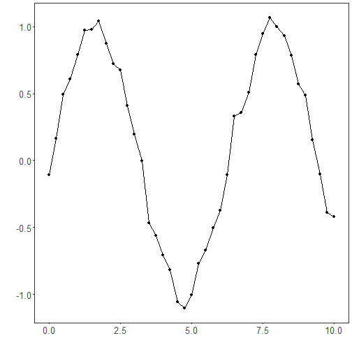
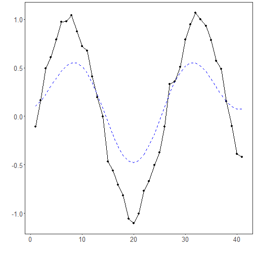

FFT filter: The signal is transformed to the frequency domain via the discrete Fourier transform (DFT). A low‑pass filter attenuates components above a cutoff, and the inverse DFT reconstructs a smoothed signal. This approach cleanly separates trend/low‑frequency content from high‑frequency noise.

Objective: Apply frequency-domain smoothing (FFT) by removing high-frequency components to reduce noise.


``` r
# Filter - FFT

# Installing the package (if needed)
#install.packages("tspredit")
```


``` r
# Loading the packages
library(daltoolbox)
library(tspredit) 
```


``` r
# Series for study with artificial noise and spikes

data(tsd)
y <- tsd$y
noise <- rnorm(length(y), 0, sd(y)/10)
spike <- rnorm(1, 0, sd(y))
tsd$y <- tsd$y + noise
tsd$y[10] <- tsd$y[10] + spike
tsd$y[20] <- tsd$y[20] + spike
tsd$y[30] <- tsd$y[30] + spike
```


``` r
# Noisy series visualization
library(ggplot2)
plot_ts(x=tsd$x, y=tsd$y) + theme(text = element_text(size=16))
```




``` r
# Applying the FFT filter

filter <- ts_fil_fft()
filter <- fit(filter, tsd$y)
y <- transform(filter, tsd$y)
plot_ts_pred(y=tsd$y, yadj=y) + theme(text = element_text(size=16))
```



References
- A. V. Oppenheim and R. W. Schafer (2010). Discrete-Time Signal Processing. Prentice Hall.
