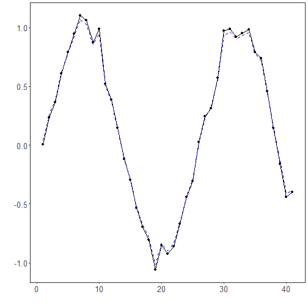

The Hodrick-Prescott (HP) filter: HP solves an optimization problem that trades off fidelity to the data and smoothness of the trend by penalizing the sum of squared second differences of the trend component. The smoothing parameter λ controls the balance: larger λ yields a smoother trend and a more aggressively filtered cycle.

Notes:
- The smoothing strength is governed by a lambda parameter internally; higher lambda produces a smoother trend and stronger cycle removal.
- HP can introduce endpoint bias; be cautious interpreting the last observations.

Objetives: The Hodrick-Prescott (HP) filter decomposes a series into trend and cyclical components by penalizing changes in the trend's second derivative. It is widely used in economics to obtain a smooth long-run trend.


``` r
# Filter - Hodrick-Prescott

# Install tspredit if needed
#install.packages("tspredit")
```


``` r
# Load packages
library(daltoolbox)
library(tspredit) 
```


``` r
# Prepare a noisy series example with spikes
data(tsd)
y <- tsd$y
noise <- rnorm(length(y), 0, sd(y)/10)
spike <- rnorm(1, 0, sd(y))
tsd$y <- tsd$y + noise
tsd$y[10] <- tsd$y[10] + spike
tsd$y[20] <- tsd$y[20] + spike
tsd$y[30] <- tsd$y[30] + spike
```


``` r
library(ggplot2)
# Visualize noisy input
plot_ts(x=tsd$x, y=tsd$y) + theme(text = element_text(size=16))
```


``` r
# Apply the HP filter (trend extraction)

filter <- ts_fil_hp()             # uses default lambda internally
filter <- fit(filter, tsd$y)
y <- transform(filter, tsd$y)     # returns trend-adjusted output

# Compare original vs trend component (or adjusted)
plot_ts_pred(y=tsd$y, yadj=y) + theme(text = element_text(size=16))
```



References
- R. J. Hodrick and E. C. Prescott (1997). Postwar U.S. Business Cycles: An Empirical Investigation. Journal of Money, Credit and Banking, 29(1), 1–16.
