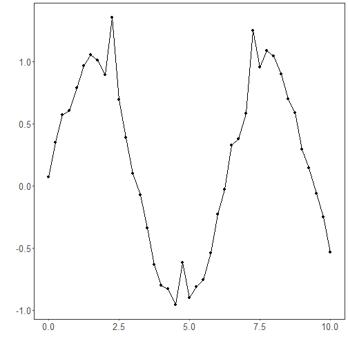
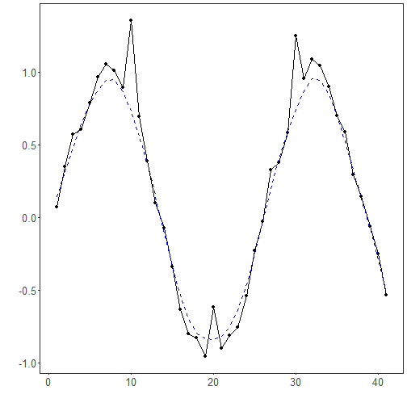

``` r
# Filter - Lowess

# Installing tspredit
install.packages("tspredit")
```

```

```


``` r
# Loading tspredit
library(daltoolbox)
library(tspredit) 
```


``` r
# Series for studying with added noise

data(tsd)
y <- tsd$y
noise <- rnorm(length(y), 0, sd(y)/10)
spike <- rnorm(1, 0, sd(y))
tsd$y <- tsd$y + noise
tsd$y[10] <- tsd$y[10] + spike
tsd$y[20] <- tsd$y[20] + spike
tsd$y[30] <- tsd$y[30] + spike
```


``` r
library(ggplot2)
plot_ts(x=tsd$x, y=tsd$y) + theme(text = element_text(size=16))
```




``` r
# lowess filter

filter <- ts_fil_lowess(f = 0.2)
filter <- fit(filter, tsd$y)
y <- transform(filter, tsd$y)
plot_ts_pred(y=tsd$y, yadj=y) + theme(text = element_text(size=16))
```



