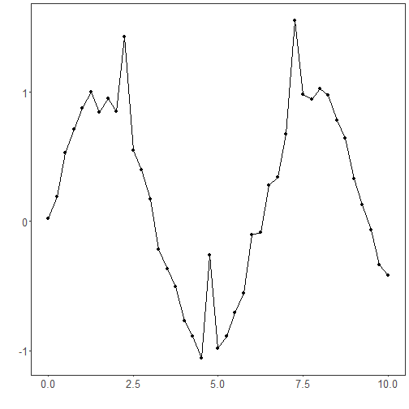
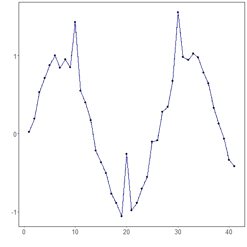

``` r
# Filter - none

# Installing tspredit
install.packages("tspredit")
```

```

```


``` r
# Loading tspredit
library(daltoolbox)
library(tspredit) 
```


``` r
# Series for studying with added noise

data(sin_data)
y <- sin_data$y
noise <- rnorm(length(y), 0, sd(y)/10)
spike <- rnorm(1, 0, sd(y))
sin_data$y <- sin_data$y + noise
sin_data$y[10] <- sin_data$y[10] + spike
sin_data$y[20] <- sin_data$y[20] + spike
sin_data$y[30] <- sin_data$y[30] + spike
```


``` r
library(ggplot2)
plot_ts(x=sin_data$x, y=sin_data$y) + theme(text = element_text(size=16))
```




``` r
# filtering

filter <- ts_fil_none()
filter <- fit(filter, sin_data$y)
y <- transform(filter, sin_data$y)
plot_ts_pred(y=sin_data$y, yadj=y) + theme(text = element_text(size=16))
```



