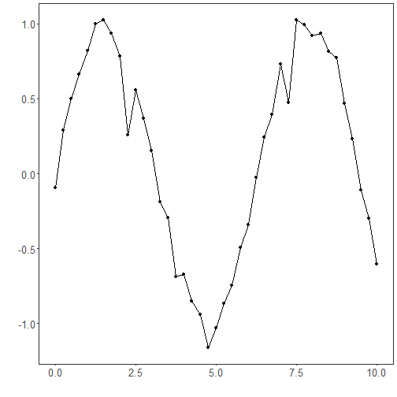
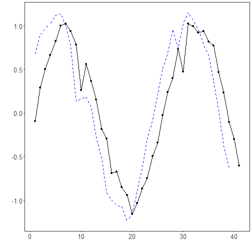

Overview

Quadratic Exponential Smoothing (QES) models level and trend using exponentially weighted averages with a quadratic form. It is useful for trend-dominated series where you want a smooth estimate that adapts to gradual changes.

Key parameter
- `gamma`: controls whether seasonal/trend gain is adapted (package-specific); set to `FALSE` to keep default behavior.


``` r
# Filter - Quadratic Exponential Smoothing

# Install tspredit if needed
#install.packages("tspredit")
```


``` r
# Load packages
library(daltoolbox)
library(tspredit) 
```


``` r
# Prepare a noisy series with injected spikes
data(tsd)
y <- tsd$y
noise <- rnorm(length(y), 0, sd(y)/10)
spike <- rnorm(1, 0, sd(y))
tsd$y <- tsd$y + noise
tsd$y[10] <- tsd$y[10] + spike
tsd$y[20] <- tsd$y[20] + spike
tsd$y[30] <- tsd$y[30] + spike
```


``` r
library(ggplot2)
# Visualize the noisy input
plot_ts(x=tsd$x, y=tsd$y) + theme(text = element_text(size=16))
```




``` r
# Apply Quadratic Exponential Smoothing

filter <- ts_fil_qes(gamma = FALSE)  # default behavior without gamma adaptation
filter <- fit(filter, tsd$y)
y <- transform(filter, tsd$y)

# Compare original vs smoothed
plot_ts_pred(y=tsd$y, yadj=y) + theme(text = element_text(size=16))
```



