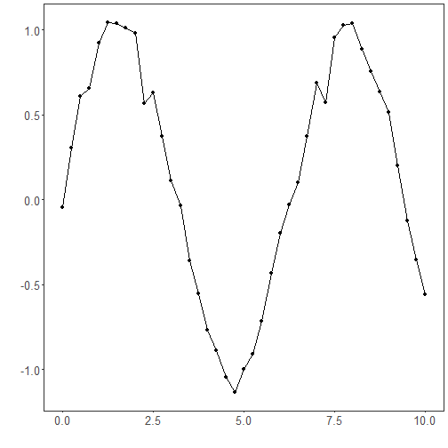
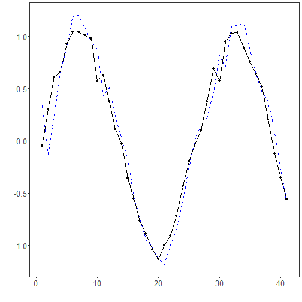

Overview

Seasonal adjustment aims to remove periodic seasonal components from a series, making the underlying trend and cycle easier to analyze. After adjustment, remaining variation should reflect non-seasonal dynamics.

Notes
- Ensure the frequency/periodicity in your data is appropriate for seasonal estimation.
- Seasonal adjustment methods can differ in how they model trend and irregular components.


``` r
# Filter - seasonal adjustment

# Install tspredit if needed
#install.packages("tspredit")
```


``` r
# Load packages
library(daltoolbox)
library(tspredit) 
```


``` r
# Prepare a series (with added noise/spikes for illustration)
data(tsd)
y <- tsd$y
noise <- rnorm(length(y), 0, sd(y)/10)
spike <- rnorm(1, 0, sd(y))
tsd$y <- tsd$y + noise
tsd$y[10] <- tsd$y[10] + spike
tsd$y[20] <- tsd$y[20] + spike
tsd$y[30] <- tsd$y[30] + spike
```


``` r
library(ggplot2)
# Visualize original (noisy) series
plot_ts(x=tsd$x, y=tsd$y) + theme(text = element_text(size=16))
```




``` r
# Apply seasonal adjustment

filter <- ts_fil_seas_adj()     # adjust for seasonal effects
filter <- fit(filter, tsd$y)
y <- transform(filter, tsd$y)

# Compare original vs seasonally adjusted
plot_ts_pred(y=tsd$y, yadj=y) + theme(text = element_text(size=16))
```



