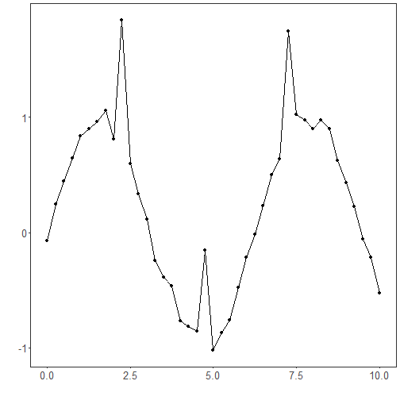
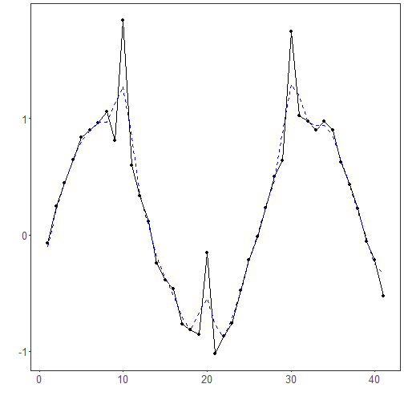

Wavelet filter: Wavelet denoising decomposes the signal into multi‑resolution detail and approximation coefficients. By thresholding high‑frequency detail coefficients and reconstructing, it suppresses noise while retaining sharp features better than many global smoothers.

Objective: Apply denoising with discrete wavelets (MODWT), removing high-frequency details to smooth the series.


``` r
# Filter - Wavelets

# Installing the package (if needed)
#install.packages("tspredit")
```


``` r
# Loading the packages
library(daltoolbox)
library(tspredit) 
```


``` r
# Series for study with artificial noise and spikes

data(tsd)
y <- tsd$y
noise <- rnorm(length(y), 0, sd(y)/10)
spike <- rnorm(1, 0, sd(y))
tsd$y <- tsd$y + noise
tsd$y[10] <- tsd$y[10] + spike
tsd$y[20] <- tsd$y[20] + spike
tsd$y[30] <- tsd$y[30] + spike
```


``` r
library(ggplot2)
# Noisy series visualization
plot_ts(x=tsd$x, y=tsd$y) + theme(text = element_text(size=16))
```




``` r
# Applying the Wavelet filter

filter <- ts_fil_wavelet()
filter <- fit(filter, tsd$y)
y <- transform(filter, tsd$y)
plot_ts_pred(y=tsd$y, yadj=y) + theme(text = element_text(size=16))
```



References
- D. L. Donoho and I. M. Johnstone (1994). Ideal spatial adaptation by wavelet shrinkage. Biometrika, 81(3), 425–455.
