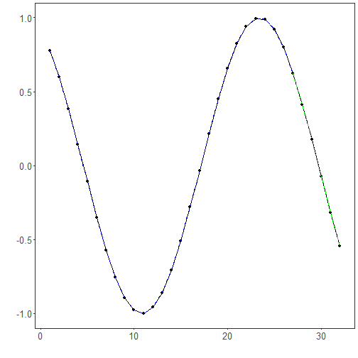

Objetivo: Treinar e avaliar uma CNN 1D (Conv1D) para previsão de séries temporais com janelas deslizantes, incluindo normalização, ajuste e avaliação.


``` r
# Regressão de Série Temporal - CNN 1D (Conv1D)

# Instalando pacotes (se necessário)

install.packages("tspredit")
```


``` r
# Carregando os pacotes
library(daltoolbox)
library(daltoolboxdp)
library(tspredit)
```


``` r
# Série para estudo e janelas deslizantes

data(tsd)
ts <- ts_data(tsd$y, 10)
ts_head(ts, 3)
```

```
##             t9        t8        t7        t6        t5        t4        t3        t2        t1        t0
## [1,] 0.0000000 0.2474040 0.4794255 0.6816388 0.8414710 0.9489846 0.9974950 0.9839859 0.9092974 0.7780732
## [2,] 0.2474040 0.4794255 0.6816388 0.8414710 0.9489846 0.9974950 0.9839859 0.9092974 0.7780732 0.5984721
## [3,] 0.4794255 0.6816388 0.8414710 0.9489846 0.9974950 0.9839859 0.9092974 0.7780732 0.5984721 0.3816610
```


``` r
# Visualização da série
library(ggplot2)
plot_ts(x=tsd$x, y=tsd$y) + theme(text = element_text(size=16))
```


``` r
# Separação treino-teste e projeção (X, y)

samp <- ts_sample(ts, test_size = 5)
io_train <- ts_projection(samp$train)
io_test <- ts_projection(samp$test)
```


``` r
# Treinando a CNN 1D

model <- ts_conv1d(ts_norm_gminmax(), input_size=4, epochs=10000)
model <- fit(model, x=io_train$input, y=io_train$output)
```


``` r
# Avaliação do ajuste (treino)

adjust <- predict(model, io_train$input)
adjust <- as.vector(adjust)
output <- as.vector(io_train$output)
ev_adjust <- evaluate(model, output, adjust)
ev_adjust$mse
```

```
## [1] 9.231487e-06
```


``` r
# Previsão no conjunto de teste

prediction <- predict(model, x=io_test$input[1,], steps_ahead=5)
prediction <- as.vector(prediction)
output <- as.vector(io_test$output)
ev_test <- evaluate(model, output, prediction)
ev_test
```

```
## $values
## [1]  0.41211849  0.17388949 -0.07515112 -0.31951919 -0.54402111
## 
## $prediction
## [1]  0.41806122  0.18028717 -0.06478005 -0.30520332 -0.52701812
## 
## $smape
## [1] 0.05525128
## 
## $mse
## [1] 0.0001355703
## 
## $R2
## [1] 0.9988291
## 
## $metrics
##            mse      smape        R2
## 1 0.0001355703 0.05525128 0.9988291
```


``` r
# Gráfico dos resultados

yvalues <- c(io_train$output, io_test$output)
plot_ts_pred(y=yvalues, yadj=adjust, ypre=prediction) + theme(text = element_text(size=16))
```



