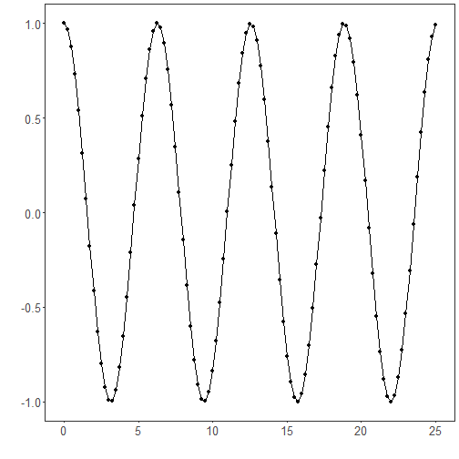
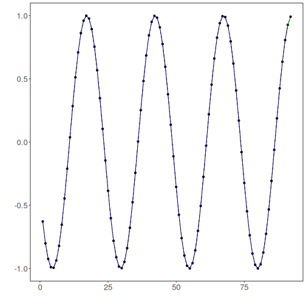

Overview

Integrated tuning automates hyperparameter search for time-series learners in a single pipeline. It handles preprocessing, window size, and model hyperparameters, then evaluates and returns the best configuration for your training data.

What you will learn
- Create sliding windows suitable for supervised learning
- Split the data into train/test respecting time order
- Define a search space and run integrated tuning
- Inspect evaluation metrics and visualize predictions


``` r
# Install tspredit if needed
#install.packages("tspredit")
```


``` r
# Load packages
library(daltoolbox)
library(tspredit) 
```


``` r
# Create a simple cosine series for demonstration

i <- seq(0, 25, 0.25)
x <- cos(i)
```


``` r
# Visualize the time series
plot_ts(x=i, y=x) + theme(text = element_text(size=16))
```




``` r
# Sliding windows

# Create a sliding-window matrix for supervised learning.
# Each row contains 10 attributes (t9..t0) representing the last 10 observations.
sw_size <- 10
ts <- ts_data(x, sw_size)
ts_head(ts, 3)
```

```
##             t9        t8        t7        t6        t5         t4         t3         t2         t1         t0
## [1,] 1.0000000 0.9689124 0.8775826 0.7316889 0.5403023  0.3153224  0.0707372 -0.1782461 -0.4161468 -0.6281736
## [2,] 0.9689124 0.8775826 0.7316889 0.5403023 0.3153224  0.0707372 -0.1782461 -0.4161468 -0.6281736 -0.8011436
## [3,] 0.8775826 0.7316889 0.5403023 0.3153224 0.0707372 -0.1782461 -0.4161468 -0.6281736 -0.8011436 -0.9243024
```


``` r
# Data sampling (train/test split)

test_size <- 1                  # keep last step for testing
samp <- ts_sample(ts, test_size)
ts_head(samp$train, 3)
```

```
##             t9        t8        t7        t6        t5         t4         t3         t2         t1         t0
## [1,] 1.0000000 0.9689124 0.8775826 0.7316889 0.5403023  0.3153224  0.0707372 -0.1782461 -0.4161468 -0.6281736
## [2,] 0.9689124 0.8775826 0.7316889 0.5403023 0.3153224  0.0707372 -0.1782461 -0.4161468 -0.6281736 -0.8011436
## [3,] 0.8775826 0.7316889 0.5403023 0.3153224 0.0707372 -0.1782461 -0.4161468 -0.6281736 -0.8011436 -0.9243024
```

``` r
ts_head(samp$test)
```

```
##              t9        t8         t7          t6        t5       t4       t3        t2        t1        t0
## [1,] -0.7256268 -0.532833 -0.3069103 -0.06190529 0.1869486 0.424179 0.635036 0.8064095 0.9276444 0.9912028
```


``` r
# Define integrated tuning

# We will:
# - search over input window sizes (3..5)
# - use ELM as the base model
# - apply global min-max normalization as preprocessing
# - explore ranges for hidden units and activation function

tune <- ts_integtune(input_size=c(3:5), base_model = ts_elm(), preprocess = list(ts_norm_gminmax()),
                     ranges = list(nhid = 1:5, actfun=c('sig', 'radbas', 'tribas', 'relu', 'purelin')))
```


``` r
# Fit the tuned pipeline on training data

io_train <- ts_projection(samp$train)
model <- fit(tune, x=io_train$input, y=io_train$output)
```


``` r
# Evaluate training adjustment (in-sample)

adjust <- predict(model, io_train$input)
ev_adjust <- evaluate(model, io_train$output, adjust)
print(head(ev_adjust$metrics))
```

```
##           mse        smape R2
## 1 7.56133e-30 1.014266e-14  1
```


``` r
# Forecast on the test segment

steps_ahead <- 1
io_test <- ts_projection(samp$test)
prediction <- predict(model, x=io_test$input, steps_ahead=steps_ahead)
prediction <- as.vector(prediction)

output <- as.vector(io_test$output)
if (steps_ahead > 1)
    output <- output[1:steps_ahead]

print(sprintf("%.2f, %.2f", output, prediction))
```

```
## [1] "0.99, 0.99"
```


``` r
# Evaluate test performance

ev_test <- evaluate(model, output, prediction)
print(head(ev_test$metrics))
```

```
##            mse        smape   R2
## 1 2.496005e-29 5.040344e-15 -Inf
```

``` r
print(sprintf("smape: %.2f", 100*ev_test$metrics$smape))
```

```
## [1] "smape: 0.00"
```


``` r
# Plot results

yvalues <- c(io_train$output, io_test$output)
plot_ts_pred(y=yvalues, yadj=adjust, ypre=prediction) + theme(text = element_text(size=16))
```




``` r
# Example hyperparameter ranges by model

# ELM
ranges_elm <- list(nhid = 1:20, actfun=c('sig', 'radbas', 'tribas', 'relu', 'purelin'))

# MLP
ranges_mlp <- list(size = 1:10, decay = seq(0, 1, 1/9), maxit=10000)

# RF
ranges_rf <- list(nodesize=1:10, ntree=1:10)

# SVM
ranges_svm <- list(kernel=c("radial", "poly", "linear", "sigmoid"), epsilon=seq(0, 1, 0.1), cost=seq(20, 100, 20))

# LSTM
ranges_lstm <- list(input_size = 1:10, epochs=10000)

# CNN
ranges_cnn <- list(input_size = 1:10, epochs=10000)
```

