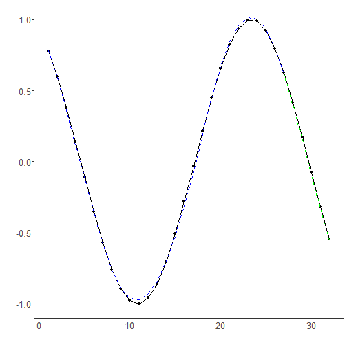

Objetivo: Treinar e avaliar um modelo LSTM para previsão de séries temporais com janelas deslizantes, incluindo normalização, ajuste e avaliação no teste.


``` r
# Regressão de Série Temporal - LSTM

# Instalando pacotes (se necessário)

install.packages("tspredit")
```


``` r
# Carregando os pacotes
library(daltoolbox)
library(daltoolboxdp)
library(tspredit)
```


``` r
# Série para estudo e janelas deslizantes

data(tsd)
ts <- ts_data(tsd$y, 10)
ts_head(ts, 3)
```

```
##             t9        t8        t7        t6        t5        t4        t3        t2        t1        t0
## [1,] 0.0000000 0.2474040 0.4794255 0.6816388 0.8414710 0.9489846 0.9974950 0.9839859 0.9092974 0.7780732
## [2,] 0.2474040 0.4794255 0.6816388 0.8414710 0.9489846 0.9974950 0.9839859 0.9092974 0.7780732 0.5984721
## [3,] 0.4794255 0.6816388 0.8414710 0.9489846 0.9974950 0.9839859 0.9092974 0.7780732 0.5984721 0.3816610
```


``` r
# Visualização da série
library(ggplot2)
plot_ts(x=tsd$x, y=tsd$y) + theme(text = element_text(size=16))
```


``` r
# Separação treino-teste e projeção (X, y)

samp <- ts_sample(ts, test_size = 5)
io_train <- ts_projection(samp$train)
io_test <- ts_projection(samp$test)
```


``` r
# Treinando o modelo LSTM

model <- ts_lstm(ts_norm_gminmax(), input_size=4, epochs=10000)
model <- fit(model, x=io_train$input, y=io_train$output)
```


``` r
# Avaliação do ajuste (treino)

adjust <- predict(model, io_train$input)
adjust <- as.vector(adjust)
output <- as.vector(io_train$output)
ev_adjust <- evaluate(model, output, adjust)
ev_adjust$mse
```

```
## [1] 0.0001542692
```


``` r
# Previsão no conjunto de teste

steps_ahead <- 1
io_test <- ts_projection(samp$test)
prediction <- predict(model, x=io_test$input, steps_ahead=steps_ahead)
prediction <- as.vector(prediction)

output <- as.vector(io_test$output)
if (steps_ahead > 1)
    output <- output[1:steps_ahead]

print(sprintf("%.2f, %.2f", output, prediction))
```

```
## [1] "0.41, 0.43"   "0.17, 0.19"   "-0.08, -0.06" "-0.32, -0.32" "-0.54, -0.56"
```


``` r
# Avaliação no conjunto de teste

ev_test <- evaluate(model, output, prediction)
print(head(ev_test$metrics))
```

```
##            mse     smape        R2
## 1 0.0001902551 0.0693699 0.9983568
```

``` r
print(sprintf("smape: %.2f", 100*ev_test$metrics$smape))
```

```
## [1] "smape: 6.94"
```


``` r
# Gráfico dos resultados

yvalues <- c(io_train$output, io_test$output)
plot_ts_pred(y=yvalues, yadj=adjust, ypre=prediction) + theme(text = element_text(size=16))
```



