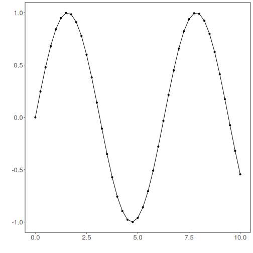
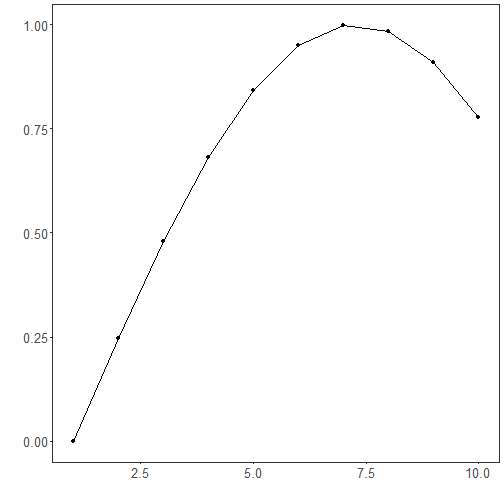

Overview

Exponential Adaptive Normalization (EAN) rescales each sliding window using exponentially weighted statistics so that the model focuses on shape rather than absolute level. This is helpful when the series level drifts over time (non-stationary mean/variance).

Key parameter
- `nw`: the effective window span for the exponential averages; smaller values adapt faster to recent changes.


``` r
# Exponential Adaptive Normalization

# Install tspredit if needed
#install.packages("tspredit")
```


``` r
# Load packages
library(daltoolbox)
library(tspredit) 
```


``` r
# Load a sample series

data(tsd)
```


``` r
library(ggplot2)
# Visualize original series
plot_ts(x=tsd$x, y=tsd$y) + theme(text = element_text(size=16))
```




``` r
# Build sliding windows for supervised learning

sw_size <- 10
ts <- ts_data(tsd$y, sw_size)
ts_head(ts, 3)
```

```
##             t9        t8        t7        t6        t5        t4        t3        t2        t1        t0
## [1,] 0.0000000 0.2474040 0.4794255 0.6816388 0.8414710 0.9489846 0.9974950 0.9839859 0.9092974 0.7780732
## [2,] 0.2474040 0.4794255 0.6816388 0.8414710 0.9489846 0.9974950 0.9839859 0.9092974 0.7780732 0.5984721
## [3,] 0.4794255 0.6816388 0.8414710 0.9489846 0.9974950 0.9839859 0.9092974 0.7780732 0.5984721 0.3816610
```

``` r
summary(ts[,10])
```

```
##        t0          
##  Min.   :-0.99929  
##  1st Qu.:-0.55091  
##  Median : 0.05397  
##  Mean   : 0.02988  
##  3rd Qu.: 0.63279  
##  Max.   : 0.99460
```


``` r
library(ggplot2)
# Visualize the target column (t0) after windowing
plot_ts(y=ts[,10]) + theme(text = element_text(size=16))
```


``` r
# Apply Exponential Adaptive Normalization

preproc <- ts_norm_ean(nw = 3)   # faster adaptation with smaller nw
preproc <- fit(preproc, ts)
tst <- transform(preproc, ts)
ts_head(tst, 3)
```

```
##             t9        t8        t7        t6        t5        t4        t3        t2        t1        t0
## [1,] 0.2323665 0.3104452 0.3836695 0.4474864 0.4979282 0.5318587 0.5471682 0.5429048 0.5193337 0.4779203
## [2,] 0.3580339 0.4312581 0.4950750 0.5455169 0.5794473 0.5947568 0.5904935 0.5669224 0.5255090 0.4688283
## [3,] 0.4924682 0.5562851 0.6067269 0.6406574 0.6559669 0.6517035 0.6281324 0.5867191 0.5300384 0.4616144
```

``` r
summary(tst[,10])
```

```
##        t0        
##  Min.   :0.4545  
##  1st Qu.:0.4608  
##  Median :0.4804  
##  Mean   :0.4911  
##  3rd Qu.:0.5226  
##  Max.   :0.5437
```

``` r
# Inspect one normalized window (shape emphasized)
plot_ts(y=ts[1,]) + theme(text = element_text(size=16))
```



