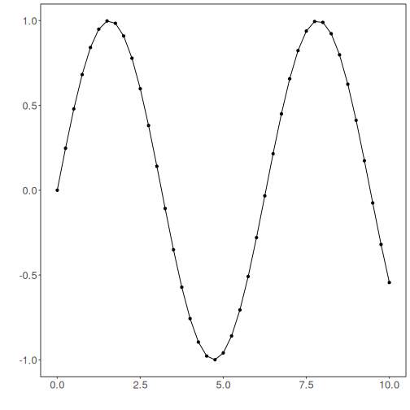

``` r
install.packages("tspredit")

# loading tspredit
library(tspredit) 
```


``` r
# Series for studying

data(tsd)
```


``` r
library(ggplot2)
plot_ts(x=tsd$x, y=tsd$y) + theme(text = element_text(size=16))
```




``` r
# sliding windows

sw_size <- 5
ts <- ts_data(tsd$y, sw_size)
ts_head(ts, 3)
```

```
##             t4        t3        t2        t1        t0
## [1,] 0.0000000 0.2474040 0.4794255 0.6816388 0.8414710
## [2,] 0.2474040 0.4794255 0.6816388 0.8414710 0.9489846
## [3,] 0.4794255 0.6816388 0.8414710 0.9489846 0.9974950
```


``` r
# projection

io <- ts_projection(ts)
```


``` r
# input data
ts_head(io$input)
```

```
##             t4        t3        t2        t1
## [1,] 0.0000000 0.2474040 0.4794255 0.6816388
## [2,] 0.2474040 0.4794255 0.6816388 0.8414710
## [3,] 0.4794255 0.6816388 0.8414710 0.9489846
## [4,] 0.6816388 0.8414710 0.9489846 0.9974950
## [5,] 0.8414710 0.9489846 0.9974950 0.9839859
## [6,] 0.9489846 0.9974950 0.9839859 0.9092974
```


``` r
# output data
ts_head(io$output)
```

```
##             t0
## [1,] 0.8414710
## [2,] 0.9489846
## [3,] 0.9974950
## [4,] 0.9839859
## [5,] 0.9092974
## [6,] 0.7780732
```

