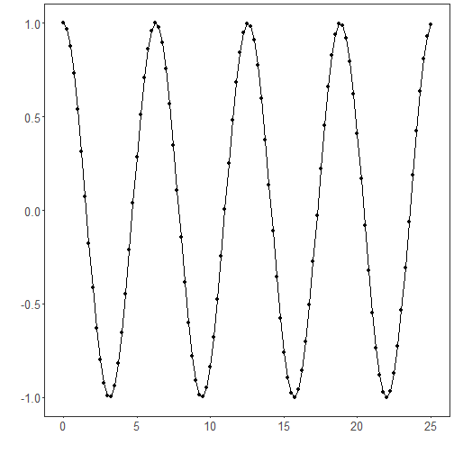

Objetivo: Realizar a busca de hiperparâmetros (tamanho da janela e parâmetros do modelo base) com validação cruzada para melhorar a previsão da série temporal, e avaliar o resultado encontrado.


``` r
# Instalando o pacote (se necessário)
install.packages("tspredit")
```


``` r
# Carregando os pacotes
library(daltoolbox)
library(tspredit) 
```


``` r
# Série cosseno para estudo

i <- seq(0, 25, 0.25)
x <- cos(i)
```


``` r
# Plotar a série

plot_ts(x=i, y=x) + theme(text = element_text(size=16))
```




``` r
# Janelas deslizantes
# Cria uma matriz de janelas (t9..t0) a partir da série para uso no treino.

sw_size <- 10
ts <- ts_data(x, sw_size)
ts_head(ts, 3)
```

```
##             t9        t8        t7        t6        t5         t4         t3         t2         t1         t0
## [1,] 1.0000000 0.9689124 0.8775826 0.7316889 0.5403023  0.3153224  0.0707372 -0.1782461 -0.4161468 -0.6281736
## [2,] 0.9689124 0.8775826 0.7316889 0.5403023 0.3153224  0.0707372 -0.1782461 -0.4161468 -0.6281736 -0.8011436
## [3,] 0.8775826 0.7316889 0.5403023 0.3153224 0.0707372 -0.1782461 -0.4161468 -0.6281736 -0.8011436 -0.9243024
```


``` r
# Amostragem (treino e teste)
# Separa os dados em treino e teste.

test_size <- 1
samp <- ts_sample(ts, test_size)
ts_head(samp$train, 3)
```

```
##             t9        t8        t7        t6        t5         t4         t3         t2         t1         t0
## [1,] 1.0000000 0.9689124 0.8775826 0.7316889 0.5403023  0.3153224  0.0707372 -0.1782461 -0.4161468 -0.6281736
## [2,] 0.9689124 0.8775826 0.7316889 0.5403023 0.3153224  0.0707372 -0.1782461 -0.4161468 -0.6281736 -0.8011436
## [3,] 0.8775826 0.7316889 0.5403023 0.3153224 0.0707372 -0.1782461 -0.4161468 -0.6281736 -0.8011436 -0.9243024
```

``` r
ts_head(samp$test)
```

```
##              t9        t8         t7          t6        t5       t4       t3        t2        t1        t0
## [1,] -0.7256268 -0.532833 -0.3069103 -0.06190529 0.1869486 0.424179 0.635036 0.8064095 0.9276444 0.9912028
```


``` r
# Ajuste de hiperparâmetros
# O ts_tune otimiza hiperparâmetros do modelo base.
# Neste exemplo, usamos ELM com faixas para nhid e função de ativação.

tune <- ts_tune(input_size=c(3:5), base_model = ts_elm(ts_norm_gminmax()), 
                ranges = list(nhid = 1:5, actfun=c('sig', 'radbas', 'tribas', 'relu', 'purelin')))
```


``` r
# Projeção de treino e ajuste do melhor modelo

io_train <- ts_projection(samp$train)

# Ajuste genérico do modelo escolhido
model <- fit(tune, x=io_train$input, y=io_train$output)
```


``` r
# Avaliação do ajuste (treino)

adjust <- predict(model, io_train$input)
ev_adjust <- evaluate(model, io_train$output, adjust)
print(head(ev_adjust$metrics))
```

```
##            mse        smape R2
## 1 3.235577e-30 7.125308e-15  1
```


``` r
# Previsão no conjunto de teste

steps_ahead <- 1
io_test <- ts_projection(samp$test)
prediction <- predict(model, x=io_test$input, steps_ahead=steps_ahead)
prediction <- as.vector(prediction)

output <- as.vector(io_test$output)
if (steps_ahead > 1)
    output <- output[1:steps_ahead]

print(sprintf("%.2f, %.2f", output, prediction))
```

```
## [1] "0.99, 0.99"
```


``` r
# Avaliação no conjunto de teste

ev_test <- evaluate(model, output, prediction)
print(head(ev_test$metrics))
```

```
##           mse        smape   R2
## 1 1.49144e-30 1.232084e-15 -Inf
```

``` r
print(sprintf("smape: %.2f", 100*ev_test$metrics$smape))
```

```
## [1] "smape: 0.00"
```


``` r
# Gráfico dos resultados

yvalues <- c(io_train$output, io_test$output)
plot_ts_pred(y=yvalues, yadj=adjust, ypre=prediction) + theme(text = element_text(size=16))
```


``` r
# Opções de faixas de hiperparâmetros por modelo

# Ranges for ELM
ranges_elm <- list(nhid = 1:20, actfun=c('sig', 'radbas', 'tribas', 'relu', 'purelin'))

# Ranges for MLP
ranges_mlp <- list(size = 1:10, decay = seq(0, 1, 1/9), maxit=10000)

# Ranges for RF
ranges_rf <- list(nodesize=1:10, ntree=1:10)

# Ranges for SVM
ranges_svm <- list(kernel=c("radial", "poly", "linear", "sigmoid"), epsilon=seq(0, 1, 0.1), cost=seq(20, 100, 20))

# Ranges for LSTM
ranges_lstm <- list(input_size = 1:10, epochs=10000)

# Ranges for CNN
ranges_cnn <- list(input_size = 1:10, epochs=10000)
```

